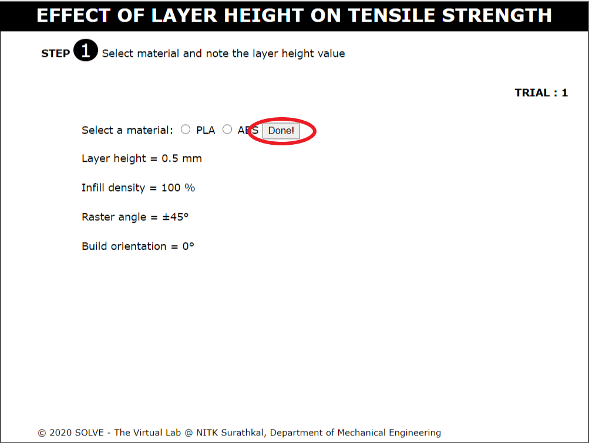
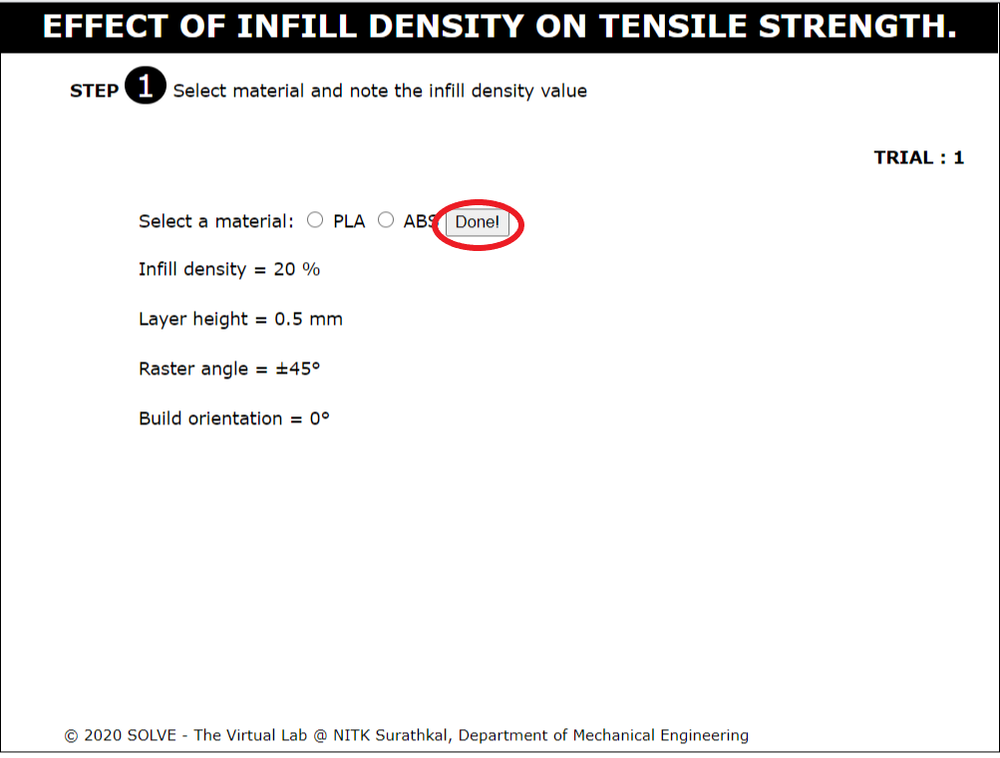
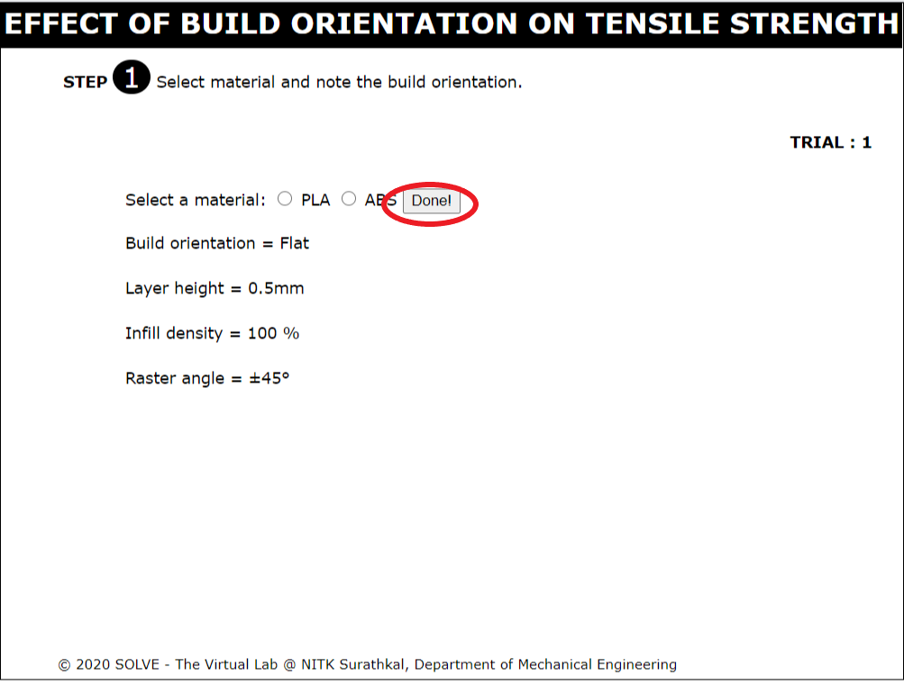
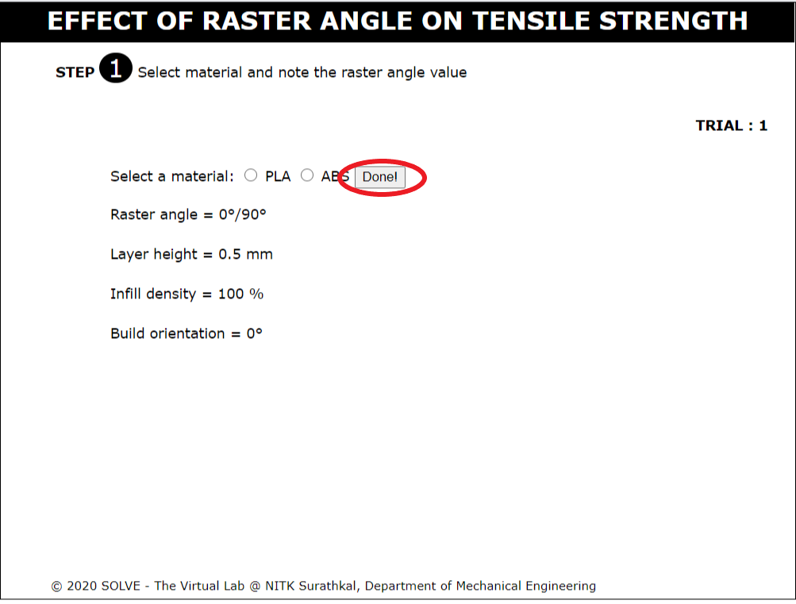

#### These procedure steps will be followed on the simulator

#### Effect of layer height on ultimate tensile strength. :

1. When you open effect of layer height on ultimate tensile strength experiment, a window will open as shown. After reading the objective and apparatus required,  move mouse pointer over the description to read and recall the basic terms. Then click the NEXT button on the bottom right corner.  
 
 

2. Now, select the material from the two options. All 5 trials will be based on this selection. Press Done! button after selection.  
 

3. Note the layer height value and then click on NEXT Button at the bottom right corner to proceed.  
 

4. Click on the extruder head to start printing. Printing will be completed layer by layer. Notice the number of layers printed. After printing is done, hover over the specimen to zoom in on the number of layers. Then click NEXT Button.
 
 
 

5. Here, click on the specimen to insert it into the universal testing machine.  
 

6. Once it is inserted, press the green button to start the tensile test. After testing is done, press the red button to stop the machine. Then press NEXT button. 
 
 
 

7. Now note the values given and press on the Formula button to reveal the equation to calculate the ultimate tensile strength. 
 

8. Use the formula to calculate the value and type it in the space provided and press Check button.  
 
 

9. If answer is right, NEXT button will be visible. If it is wrong, click on the result button to show the correct answer. Then press NEXT button. 
 
 

10. Now, note the new value of layer height and press NEXT button. 
 

11. Repeat the same steps in further trials to get values of ultimate tensile strength for different values of layer height. Notice the relation. 
 

#### Effect of infill density on ultimate tensile strength:

1. When you open effect of infill density on ultimate tensile strength experiment, a window will open as shown. After reading the objective and apparatus required,  move mouse pointer over the description to read and recall the basic terms. Then click the NEXT button on the bottom right corner.  
 
 

2. Now, select the material from the two options. All 5 trials will be based on this selection. Press Done! button after selection.  
 

3. Note the infill density value and then click on NEXT Button at the bottom right corner to proceed.  
 

4. Click on the extruder head to start printing. Printing will be completed layer by layer. Notice the amount of material in the infill. After printing is done, click NEXT Button.
 
 

5.  Here, click on the specimen to insert it into the universal testing machine.  
 

6. Once it is inserted, press the green button to start the tensile test. After testing is done, press the red button to stop the machine. Then press NEXT button. 
 
 
 

7. Now note the values given and press on the Formula button to reveal the equation to calculate the ultimate tensile strength. 
 

8. Use the formula to calculate the value and type it in the space provided and press Check button.  
 
 

9. If answer is right, NEXT button will be visible. If it is wrong, click on the result button to show the correct answer. Then press NEXT button. 
 
 

10. Now, note the new value of infill density and press NEXT button. 
 

11. Hover over specimen to reveal the inner layers. Notice the infill density.
 
 

11. Repeat the same steps in further trials to get values of ultimate tensile strength for different values of infill density. Notice the relation. 
 

#### Effect of build orientation on ultimate tensile strength.:

1. When you open effect of build orientation on ultimate tensile strength experiment, a window will open as shown. After reading the objective and apparatus required,  move mouse pointer over the description to read and recall the basic terms. Then click the NEXT button on the bottom right corner.  
 
 

2. Now, select the material from the two options. All 5 trials will be based on this selection. Press Done! button after selection.  
 

3. Note the build orientation and then click on NEXT Button at the bottom right corner to proceed.  
 

4. Click on the extruder head to start printing. Printing will be completed layer by layer. After printing is done, click NEXT Button.
 
 

5. Here, click on the specimen to insert it into the universal testing machine.  
 

6. Once it is inserted, press the green button to start the tensile test. After testing is done, press the red button to stop the machine. Then press NEXT button. 
 
 
 

7. Now note the values given and press on the Formula button to reveal the equation to calculate the ultimate tensile strength. 
 

8. Use the formula to calculate the value and type it in the space provided and press Check button.  
 
 

9. If answer is right, NEXT button will be visible. If it is wrong, click on the result button to show the correct answer. Then press NEXT button. 
 
 

10. Now, note the new build orientation and press NEXT button. 
 

11. Repeat the same steps in further trials to get values of ultimate tensile strength for different build orientations. Notice the relation. 
 

#### Effect of raster angle on ultimate tensile strength.:

1. When you open effect of raster angle on ultimate tensile strength experiment, a window will open as shown. After reading the objective and apparatus required,  move mouse pointer over the description to read and recall the basic terms. Then click the NEXT button on the bottom right corner.  
 
 

2. Now, select the material from the two options. All 5 trials will be based on this selection. Press Done! button after selection.  
 

3. Note the raster angle value and then click on NEXT Button at the bottom right corner to proceed.  
 

4. Click on the extruder head to start printing. Printing will be completed layer by layer. Notice the amount of material in the infill. After printing is done, click NEXT Button.
 
 

5.  Here, click on the specimen to insert it into the universal testing machine.  
 

6. Once it is inserted, press the green button to start the tensile test. After testing is done, press the red button to stop the machine. Then press NEXT button. 
 
 
 

7. Now note the values given and press on the Formula button to reveal the equation to calculate the ultimate tensile strength. 
 

8. Use the formula to calculate the value and type it in the space provided and press Check button.  
 
 

9. If answer is right, NEXT button will be visible. If it is wrong, click on the result button to show the correct answer. Then press NEXT button. 
 
 

10. Now, note the new value of raster angle and press NEXT button. 
 

11. Repeat the same steps in further trials to get values of ultimate tensile strength for different values of raster angle. Notice the relation. 
 
