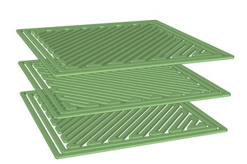

### Fused Deposition Modelling (FDM) process 

It is a 3D printing process where the material is fed into a heated nozzle from a chamber via rollers. The heated material is extruded onto a base plate, which solidifies on the plate. The nozzle/base plate moves in XY plane to deposit a layer of material. The base plate/nozzle moves in Z direction to aid the deposition of next layer on top of first layer. The whole product is built layer by layer.

  </img>  
FDM Process Schematic  
( Source: I. J. Solomon, P. Sevvel, and J. Gunasekaran, “A review on the various processing parameters in FDM,” Mater. Today Proc., no. xxxx, pp. 10–15, 2020.)

### Process Parameters:
#### 1) Layer height

It is the height of individual layers. For a given component, more layer height means lesser number of layers will be required to build it. Usually it is around the range of 50 &#181m - 500 &#181m. Lesser layer heights are preferred for more adhesion between layers and strength. Layer height shouldn't be more than the nozzle diameter.

  </img>  
Layer Height  
( Source: I. J. Solomon, P. Sevvel, and J. Gunasekaran, “A review on the various processing parameters in FDM,” Mater. Today Proc., no. xxxx, pp. 10–15, 2020. )

#### 2) Infill density

It is the amount of material filled in the product. Usually, fully compact (solid) top and bottom layers and a shell will be printed. The cavity formed like this will be filled with material. The percentage volume of the cavity that is filled is the infill density. Usually for FDM processes infill density is taken as low values in the range 18%-20%, due to importance of time and cost savings over strength.

  </img>  
Infill Density in percentage  
( Source: https://all3dp.com/2/infill-3d-printing-what-it-means-and-how-to-use-it/ )

#### 3) Feed rate

It is the speed at which the material is fed onto the build plate by the nozzle. Increased speed can lead to more material being deposited at certain points, which can lead to dimensional inaccuracies and even product failure. Higher feed rate can also lead to printer jam, where material blocks the nozzle of the extruder.

### Effected Parameters:
#### Print time

It is the total time taken to print the whole specimen. Usually, in 3D printing using FDM process, more importance is given to reducing total time and cost than to strength. This is because the parts are made for purposes that does not require very high strength. But, enough time has to be given to the process to ensure the quality and dimensional accuracy of the product.

### Fixed Parameters:
#### 1) Material

The material used here is PLA (Poly Lactic Acid). PLA is mostly used for rapid prototyping when form is more critical than function.

#### 2) Part Geometry

Geometry of part is fixed as 80*10*4 mm³ which is a ASTM standard specimen size.

  </img>  
Part Geometry  

 

#### 3) Raster pattern

It is the pattern in which the raster is applied. Line or recti-linear pattern is used here. The raster angle is fixed as ±45° in alternate layers. 

  </img>  
Rectilinear raster pattern at ±45° angle in alternate layers  
( Source:https://www.researchgate.net/figure/Rectilinear-infill-pattern-for-a-a-single-layer-b-multiple-layers-and-c-observed_fig2_330366307)

#### 4) Number of top and bottom layers and shell and shell thickness.

Number of top and bottom layers is taken as 2 and 2 shells with 0.8 mm wall thickness is selected.

  </img>  
The shell and top/bottom layers  
( Source: https://www.3dhubs.com/knowledge-base/selecting-optimal-shell-and-infill-parameters-fdm-3d-printing/ )

#### 5) Build Orientation

It is the orientation at which the product will be printed on the build plate. Build orientation is fixed at 0° or flat. For build orientations that lead to overhanging parts, use of supports becomes necessary, to hold up the specimen. Usually these supports are made of materials that are dissolvable like Polyvinyl Alcohol (PVA) and High-Impact Polystyrene (HIPS), to ensure easy removal. This will also be printed along with the specimen layer by layer. Printing of supports can lead to an increase in total time. The build plate will be kept at a lower temperature like 60&deg;C.

  </img>  
Build orientation  
( Source: T. Yao, Z. Deng, K. Zhang, and S. Li, “A method to predict the ultimate tensile strength of 3D printing polylactic acid (PLA) materials with different printing orientations,” Compos. Part B Eng., vol. 163, no. December 2018, pp. 393–402, 2019. )

