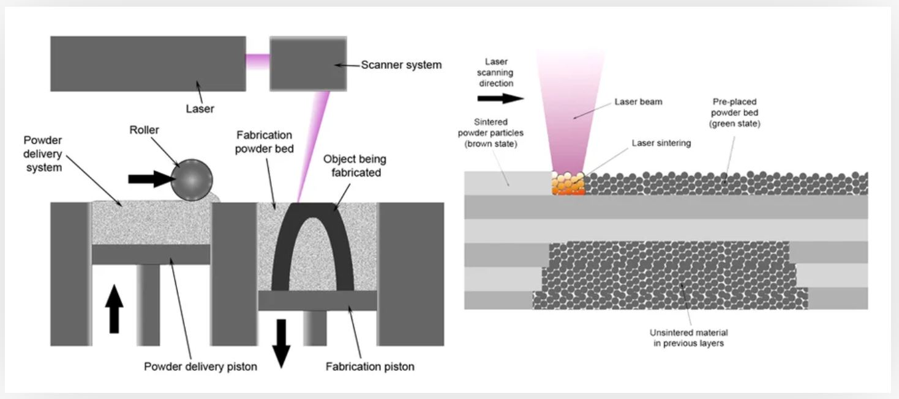
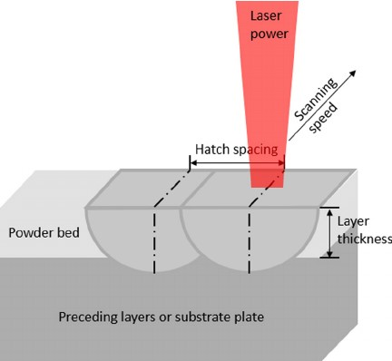
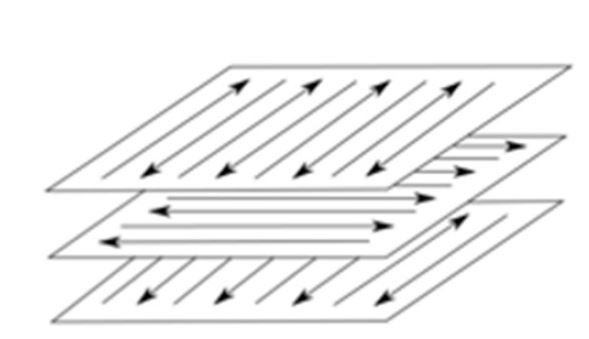

### Selective Laser Melting (SLM) process 

It is a 3D printing process which uses a high power-density laser to melt and fuse metallic powders together. A controlled amount of powder from the material feeding platform is swept into the building platform by a roller or sweeper tool. This area is levelled by the same spreading mechanism to compact the powder and homogenize the surface (powder bed). Then, a high‐power laser generates a beam that scans a given area, which corresponds to a cross‐sectional surface of the sliced CAD model of the specimen. The laser beam heats the irradiated zone enough to melt the particles of the material and to obtain a solid two‐dimensional part. Then the material platform moves up while the building platform moves down, and a new layer of powder is deposited in the building platform by the spreading mechanism and the process continues.

  </img>  
SLM Process Schematic  
( Source: https://all3dp.com/2/selective-laser-melting-slm-3d-printing-simply-explained/)

### Process Parameters:
#### 1) Laser power

It is the power of the laser being used for melting the metal. Higher laser power means higher heat concentration to melt the metal. If the laser power is very high, the high temperatures may lead to evaporation of the sample, thus losing material and consuming unnecessary energy. It can also lead to formation of gas entrapped pores in the specimen. Therefore, care should be taken to set laser power to ensure the heating of the material up to temperatures below its melting point, in this case, approximately 1500°C for stainless steel. Very less laser power can lead to defects known as LOF(Lack-Of-Fusion),where the metal powder is not fully melted to deposit a new layer on the previous layer with a sufficient overlap

#### 2) Layer height

It is the height of individual layers. For a given component, more layer height means lesser number of layers will be required to build it. Usually it is around the range of 20 &#181m - 40 &#181m, for SLM process for metals. Lesser layer heights are preferred for more adhesion between layers and strength. Optimally, layer height should be larger than the particle size of the metallic powder. Also, the maximum layer height value is limited by the penetration of the laser into the powder, which in turn depends on laser power, energy density etc.. But increased layer height can also cause staircase effect, which reduces dimensional accuracy and overall strength.

#### 3) Scanning speed

t is the speed at which laser beam travels through the metal powder. Usually, the movement of the laser beam across the powder bed is achieved using galvanometric mirrors of high accuracy, which are properly positioned to cover the entire surface. Lesser scanning speed means high density parts can be built due to the increased time spent by the laser beam on the powder. But very low scanning speeds can lead to melting of more powder, which leads to porosity defects. More speed means less heat concentration on the metal powder. This may also lead to LOF defects. Higher speeds can also lead to balling effect, where individual spheres will be formed due to insufficient melting of powder.

#### 4) Build Orientation

It is the orientation at which the product will be printed on the build plate. The build plate is usually kept at some high temperature, to prevent residual stress accumulation in the specimen, which occurs due to rapid heating and cooling. High thermal gradient between the base plate and the molten powder can also lead to warping effect, where the layer bends due to the residual thermal stresses. If there are overhangs in the structure, the underlying powder may not be able to support it and this can lead to staircase effect or dross formation which effects the quality of the product.

  </img>  
SLM porocess parameters  
( Source: C. Y. Yap et al., “Review of selective laser melting : Materials and applications,” no. December, 2015.)

### Effected Parameters:
#### Ultimate Tensile Strength

Ultimate tensile strength is the maximum stress that a material can withstand while being stretched or pulled before breaking. It is usually measured using a UTM or universal testing machine, that applies stretching or pulling load on the specimen. The load at failure is noted. The ultimate tensile strength is calculated as the ratio of ultimate load at failure to the original cross-section of the specimen.

### Fixed Parameters:
#### 1) Material

Material is fixed as stainless steel.

#### 2) Part Geometry

Geometry of part is fixed as 80*10*4 mm³ which is a ASTM standard specimen size.

  </img>  
Part Geometry  

 

#### 3) Hatch spacing

It is the distance between two parallel adjacent laser passes. Here, it is fixed as slightly greater than laser spot diameter.

#### 4) Scanning strategy

It denotes the angle at which adjacent layers are printed. It is the orientation of each layer with respect to previous layer. Here, this angle is fixed at 0°/90°.

  </img>  
Scanning strategy at 0°/90° angle in alternate layers  
( Source:T. Larimian, M. Kannan, D. Grzesiak, B. AlMangour, and T. Borkar, “Effect of energy density and scanning strategy on densification, microstructure and mechanical properties of 316L stainless steel processed via selective laser melting,” Mater. Sci. Eng. A, vol. 770, no. June 2019, p. 138455, 2020)

#### 5) Number of top and bottom layers and shell and shell thickness.

Number of top and bottom layers is taken as 2 and 2 shells with 0.8 mm wall thickness is selected.

  </img>  
The shell and top/bottom layers  
( Source: https://www.3dhubs.com/knowledge-base/selecting-optimal-shell-and-infill-parameters-SLM-3d-printing/ )

