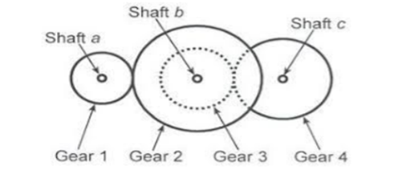

### INTRODUCTION 

Gear is the toothed wheel used to transmit power at a constant angular velocity ratio. In a compound gear train, which must hold two gears on minimum one shaft of the gear train. When we are having narrow space between input and output shafts for such kind of application, we use compound gear train, which makes large changes in speed or power output. The idler gear in simple gear train do not take part in reduction ratio but in compound gear placed gear in between help to have large reduction of speed.

The rotational direction of output shaft depends on the number of shafts and the rotational direction of the gear input of compound gear train. In the compound gear train as the two or more gears are mounted on the same shaft hence all gears on the same shaft will have same number of revolutions per minute and same direction of rotation as the shaft is having. In gears during meshing tooth of one gear meshes with the tooth from other gear along pitch circle and that mating occurs at a point called as pitch point on the pitch circle diameter resulting in power transfer.

Mathematical equations: 

#### <b>1. Module</b>

 
  

  

  

#### <b>2. Centre distance</b>  

  

  

#### <b>3. Velocity ratio</b>

  

#### <b>4. Thickness of the tooth</b>

  

Where,

m1 = is the module for the first pair of gear

m2 = is the module for the second pair of the gear

r1 = radius of the first gear

r2 = radius of the second gear

r3 = radius of the third gear

r4 = radius of the fourth gear

cd1 = centre distance between centre of first pair of the gear

cd2 = centre distance between centre of second pair of the gear

t1 = teeth on the first gear

t2 = teeth on the second gear

t3 = teeth on the third gear

t4 = teeth on the fourth gear

cd1 = centre distance between centre of first pair of the gear

N1 = RPM of the first gear

N2 = N3 = RPM of the second gear and third gear (same as they mounted on same shaft)

N4 = RPM of the fourth gear

W = thickness of the tooth

V = velocity ratio

