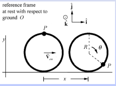

## <b> Pre-test</b>
#### Please attempt the following questions

Q1. If a pulley of radius R rotates without slipping through an angle θ, what is the relationship between the distance the wheel rolls, x, and the product Rθ? also what happens if slipping is observed.  
  
a. x = Rθ, x = Rθ   
**b. x = Rθ, x < Rθ**  
c. x < Rθ, x > Rθ  

Q2. The effective radius of the driving and driven pulleys change due to  
a. difference between input & output RPM  
**b. springs and fly-weights**  
c. both (a) and (b)  
d. due to the shape of the pulley  

Q3. A rigid body is in equilibrium if  
a. τnet = 0  
b. Fnet = 0  
**c. Both a and b**  

Q4. Given the effective radius of driving pulley to be 100mm and that of driven pulley to be 200mm, find out the effective gear ratio   
**a. 2**  
b. 0.5    
c. 0.33333  
d. 4  
