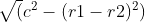
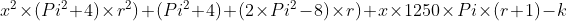

## INTRODUCTION 

   

#### User Objectives and Goals:

1. 	List the reasons for requiring gear ratios.
2. Describe conditions to be satisfied to achieve a particular gear ratio
3. Solve the mathematical equations acting on the rotating body.
4. Examine the analytical results with the simulation results
5. Observe how change in output RPM causes the change in pulley configuration.
6. Attempt the assessment questions.

#### Theory
A continuously variable transmission (CVT), also known as a shiftless transmission, stepless transmission, pulley transmission, or  in the case of motorcycles, a 'twist-and-go', is an automatic transmission that can change seamlessly through a continuous range of effective gear ratios. This contrasts with other mechanical transmissions that offer a fixed number of gear ratios. The flexibility of a CVT with suitable control may allow the input shaft to maintain a constant angular velocity even as the output speed varies.

**Equations/formulas:**  
We know that the length of the belt will be constant. henceforth assuming one of the extreme cases of gear ratio being 0.25 or 4, we get   

(tangent length) = length of the belt  

tangent length = 

This will clearly give us an approximate solution assuming the angle of wrap over the pulley is 180 degrees.
We can hence find out the solution to be  

 = y

Here the positive root of x will be the solution of radius, k will be a constant depending on the length of the belt and distance between pulleys, r will be the gear ratio and y = 0  

Derived using basic concepts of co - ordinate geometry.
