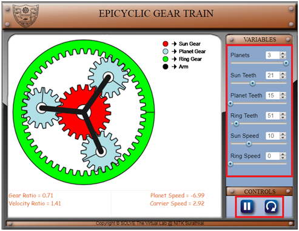
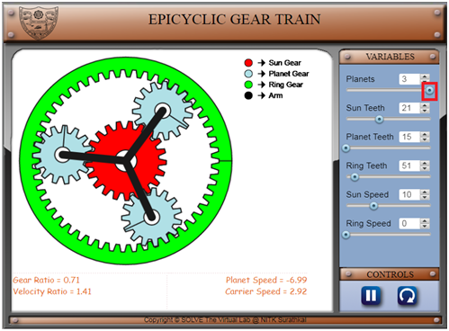
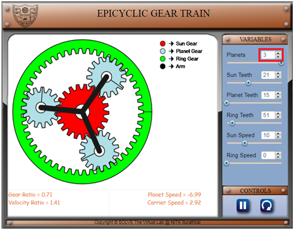
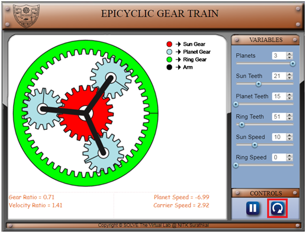
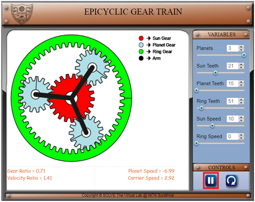
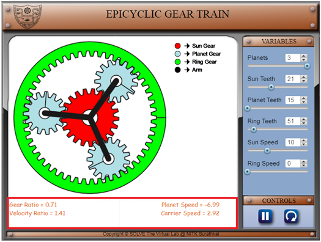

#### The following procedure steps will be followed on the simulator

1.	In simulation window front view of epicyclic gear train is displayed. 

2. Number of planet gears control pointer is given on top right of the screen, respective  teeth on gears, speed of sun and ring gears are  displayed below it and on the bottom right  play / pause and direction of rotation is available. 
 

3. Move the slider knob to the right; this causes the number of planet gears to change from 1 to 3. Similarly all the other parameters like sun teeth, planet teeth, ring teeth, sun speed, ring speed can be changed.  
 

4. Change number of planet gears from 1 to 3 can be obtained by changing the arrow marks above the slider. Similarly all the other parameters like sun teeth, planet teeth, ring teeth, sun speed, and ring speed can be changed. 
 

5.	When the rotation button is clicked the direction of rotation of the gears changes. 
 

6.	When the play / pause button is clicked the simulation starts / stops. 
 

7.	The comment box is provided at the bottom of the simulation window to get the results such as velocity ratio, gear ratio and speed in rpm of planet gear and arm. 
 
