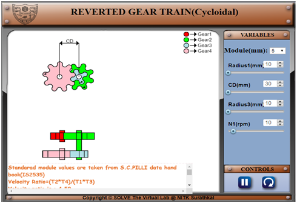
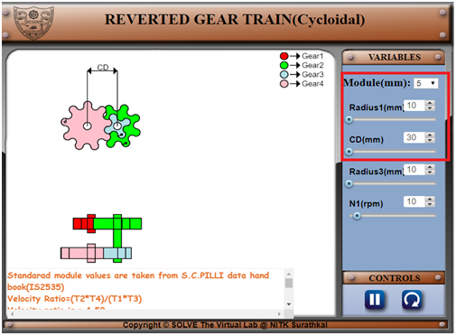
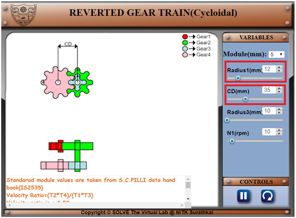
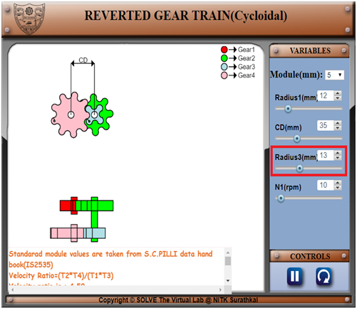
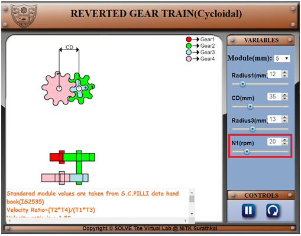
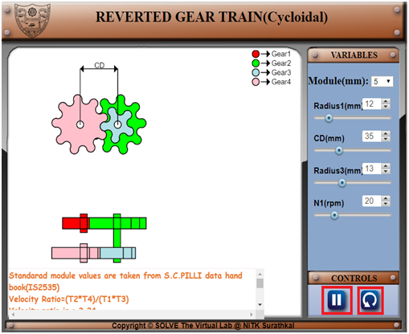
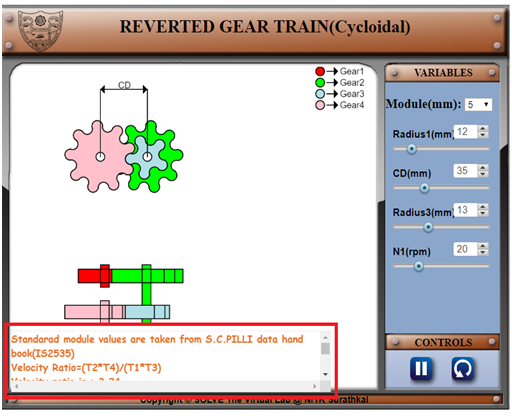

#### The following procedure steps will be followed on the simulator

1. In simulation window the colour code for all four gears are displayed. 
 

2. The module of the gear is given at the right corner with drop down and along with radius of Gear1 in mm and centre distance (CD1) in mm between Gear1 and Gear2 with slider. 
 

3. With the help for slider the radius of Gear1 in mm and centre distance (CD1) in mm between Gear1 and Gear2 can be varied. 
 

4. Likely the radius of the Gear3 is varied by using slider. 
 

5.	The speed of Gear1 (N1) in RPM is given by varying the slider position. 
 

6.	Give the direction of rotation for Gear1 by using direction button and click play button. 
 

7.	The comment box is provided at the bottom of the simulation window to get the results such as number of teeth on each gear and the speed in RPM of each gear. 
 
