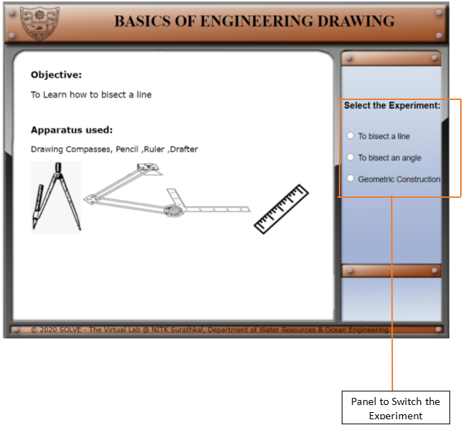
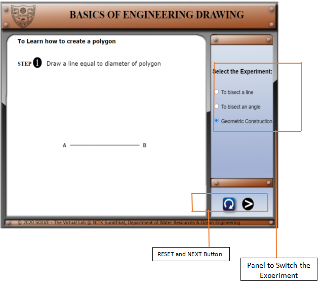
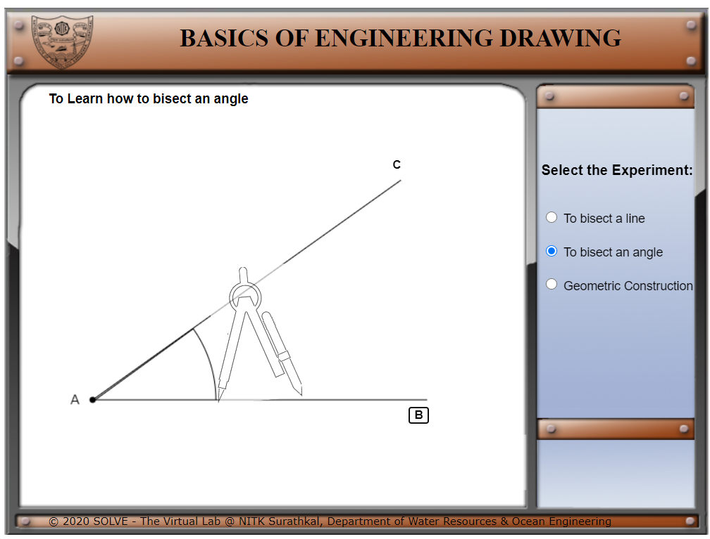
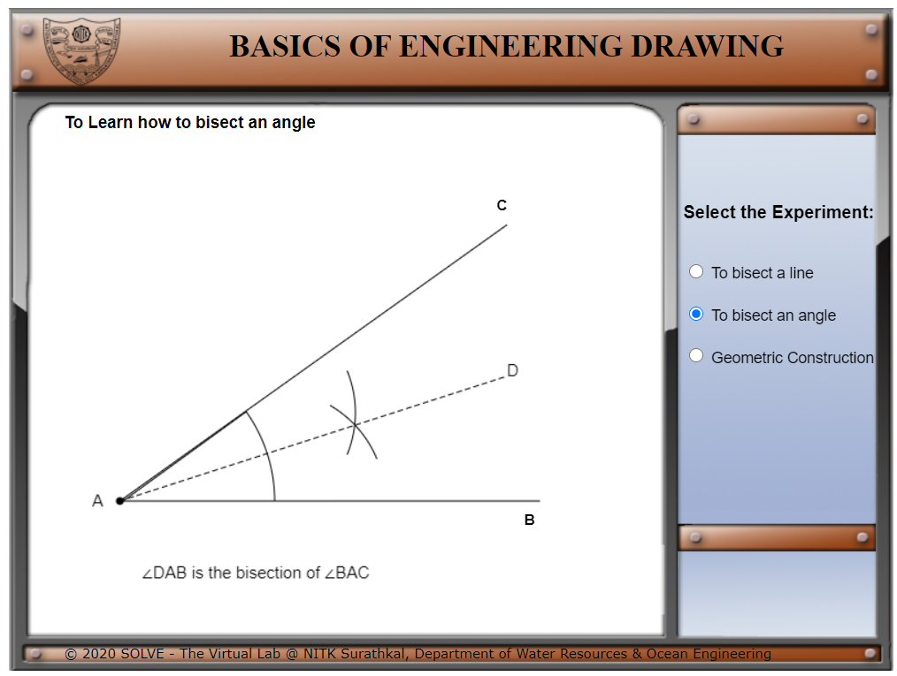
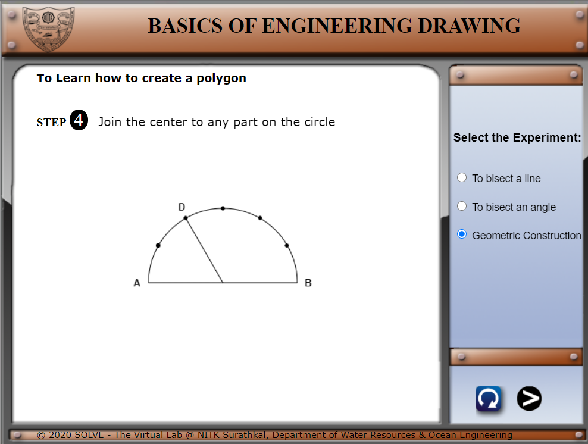
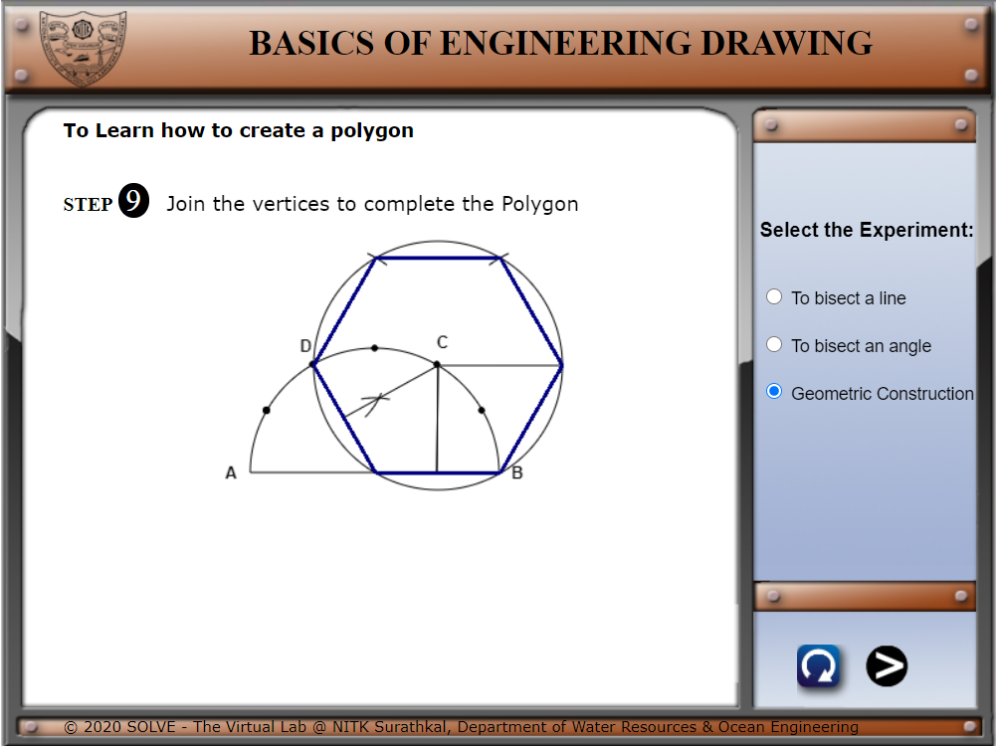
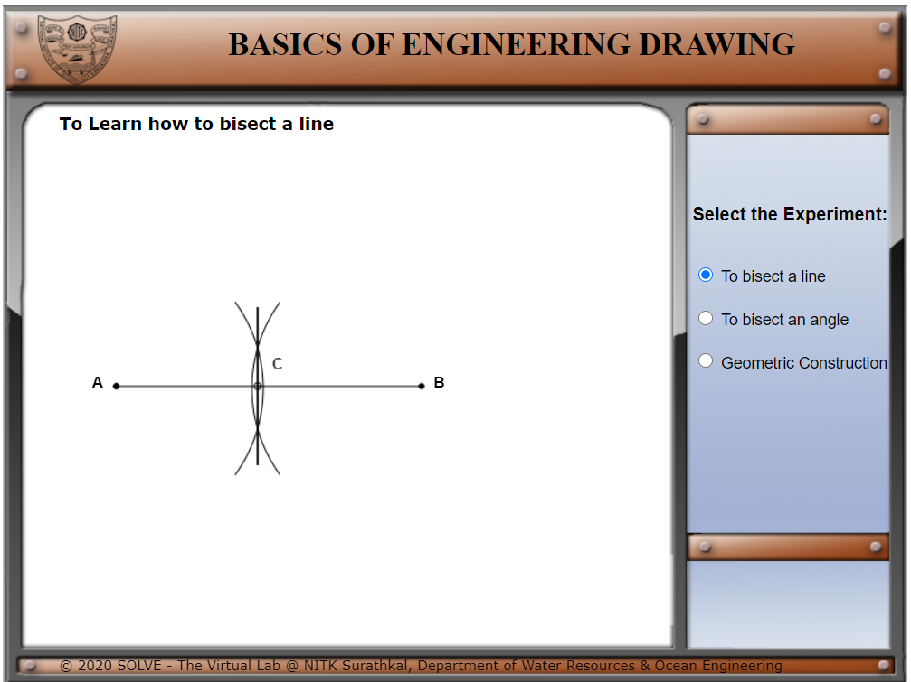

  . **Select the construction** from the panel on the right side(I.e: Angle
    bisector).

  .**Click on** highlighted button **“B”** for the next step.

  **Click on the compass** for the next step.

  .Follow the simulator to complete the construction.

  .**On completion** of one, **select the other construction** and follow the
    simulation. And complete all.

Similarly, click **Next** to get to next step in simulation

