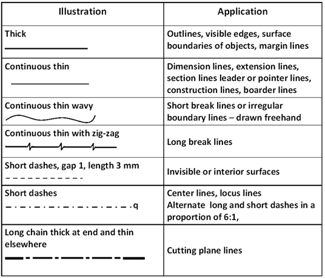
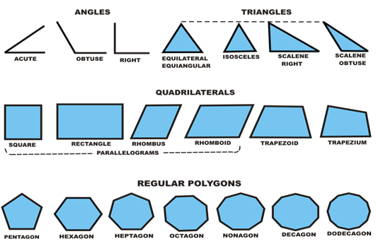
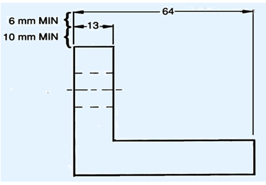
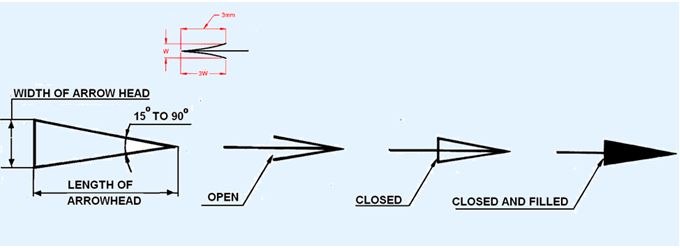
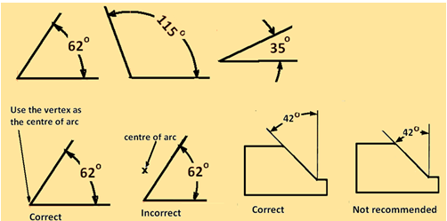

**THEORY**

**RULES OF DIMENSIONING**

1.  Between any two extension lines, there must be one and only one dimension
    line bearing one dimension.

2.  As far as possible, all the dimensions should be placed outside the views.
    Inside dimensions are preferred only if they are clearer and more easily
    readable.

3.  All the dimensions on a drawing must be shown using either Aligned System or
    Unidirectional System. In no case should, the two systems be mixed on the
    same drawing.

4.  The same unit of length should be used for all the dimensions on a drawing.
    The unit should not be written after each dimension, but a note mentioning
    the unit should be placed below the drawing.

5.  Dimension lines should not cross each other. Dimension lines should also not
    cross any other lines of the object.

6.  All dimensions must be given.

7.  Each dimension should be given only once. No dimension should be redundant.

8.  Do not use an outline or a centre line as a dimension line. A centre line
    may be extended to serve as an extension line.

9.  Avoid dimensioning hidden lines.

10. For dimensions in series, adopt any one of the following ways.

    1.  Chain dimensioning (Continuous dimensioning) All the dimensions are
        aligned in such a way that an arrowhead of one dimension touches
        tip-to-tip the arrowhead of the adjacent dimension. The overall
        dimension is placed outside the other smaller dimensions.

    2.  Parallel dimensioning (Progressive dimensioning) All the dimensions are
        shown from a common reference line. Obviously, all these dimensions
        share a common extension line. This method is adopted when dimensions
        have to be established from a particular datum surface

    3.  Combined dimensioning. When both the methods, i.e., chain dimensioning
        and parallel dimensioning are used on the same drawing, the method of
        dimensioning is called combined dimensioning.

**Lines**  
Lines is one important aspect of technical drawing. Lines are always used to
construct meaningful drawings. Various types of lines are used to construct
drawing, each line used in some specific sense. Lines are drawn following
standard conventions mentioned in BIS (SP46:2003). A line may be curved,
straight, continuous, segmented. It may be drawn as thin or thick. A few basic
types of lines widely used in drawings are shown in Table 1.

**Geometric Construction**

Drawing consists of construction of primitive geometric forms viz. points, lines
and planes that serve a the building blocks for more complicated geometric
shapes and defining the position of object in space.

The use of lines for obtaining the drawing of planes is shown in figure 1.

The important elements of dimensioning consists of extension lines, leader line,
arrows and dimensions.

**Extension line** – a thin, solid line perpendicular to a dimension line,
indicating which feature is associated with the dimension. There should be a
visible gap of 1.5 mm between the feature’s corners and the end of the extension
line.Figure 5 shows extension lines.  
**Leader line**  
A thin, solid line used to indicate the feature with which a dimension, note, or
symbol is associated. Generally this is a straight line drawn at an angle that
is neither horizontal nor vertical. Leader line is terminated with an arrow
touching the part or detail. On the end opposite the arrow, the leader line will
have a short, horizontal shoulder. Text is extended from this shoulder such that
the text height is centered with the shoulder line

Figure 5. showing extension lines

-   Arrows – 3 mm wide and should be 1/3rd as wide as they are long - symbols
    placed at the end of dimension lines to show the limits of the dimension.
    Arrows are uniform in size and style, regardless of the size of the drawing.
    Various types of arrows used for dimensioning is shown in figure 6.

Figure 6.Various types of arrows used for dimensioning

**Dimensioning of angles:** The normal convention for dimensioning of angles are
illustrated in figure 8.

source: https://nptel.ac.in/courses/112/103/112103019/

