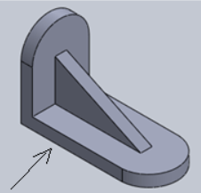
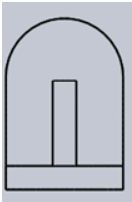

**Post-test:**

Q1. What are the three typical orthographic views of drawing?
A. Front,Top and Right side
B. Front,Right side and Isometric
C. Top,Bottom and Right side
D. Top,Front and Left side

Ans: A

Q2. Which drawing below shows the top view?

A. 

B. 

C. 

D. 

Ans:A

Q3. Is this orthographic or isometric drawing?

A. Orthographic view
B. Isometric view

Ans: B

Q4. Identify the top view of the given projection.

A. 

B.

C.

D.

Ans: A

Q5. In the term ortho-graphic, ‘orthos’ means images
A. Drawing
B. Straight
C. Projection
D. View

Ans: B
