**Pre-test:**

Q1. Which is the correct front view of given figure?

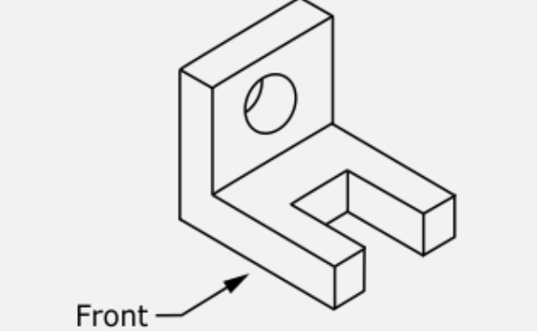

A. 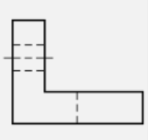

B. 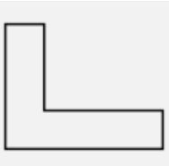

C. 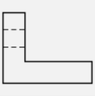

D. 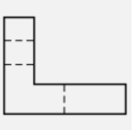

**Ans: B**

Q2. Which is the correct right side view of the given figure?

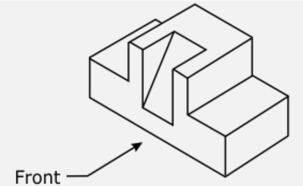

A.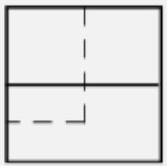

B.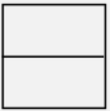

C.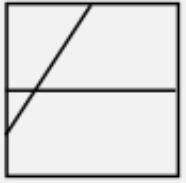

D.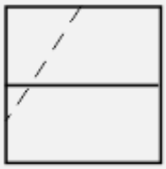

Ans:B

Q3  .Recognize the view of the given figure.

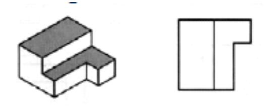

A. Top view
B. Right side view
C. Left side view
D. Front view

Ans: A

Q4. Is this an orthographic or isometric view ?

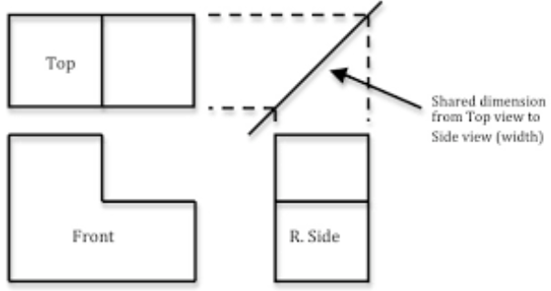

A. Isometric projection
B. Orthographic projection

Ans: B

Q5. In orthographic projection, the projection lines are \_\_\_\_\_\_ to
the projection plane.
A. Parallel
B. Orthogonal
C. Inclined
D. Any of the above

Ans: B
