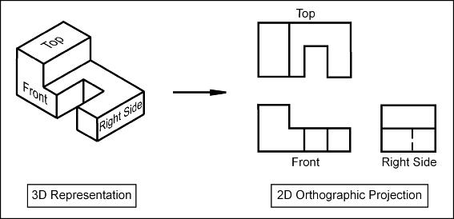

**THEORY:**

The term orthographic is sometimes reversed specifically for depictions
of objects where the principal axes or planes of the object are also
parallel with the projection plane, but these are better known as
multiview projections.

Orthographic projection is means of representing three-dimensional
objects into two dimensions. It is a form of parallel projection, in
which all the projection lines are orthogonal to the projection plane,
resulting in every plane of the scene appearing in affine transformation
on the viewing surface. The obverse of an orthographic projection is an
oblique projection, which is a parallel projection in which the
projection lines are not orthogonal to the projection plane.

