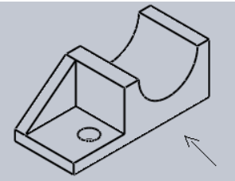
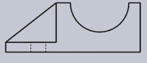
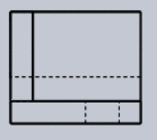
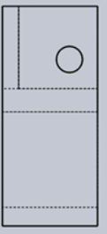
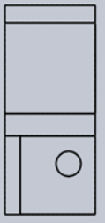
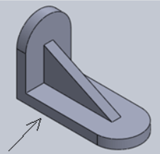
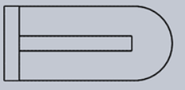
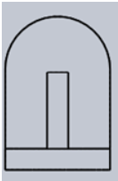

**Post-test:**
Q1.Identify the top view of the given projection.

A.

B.

C.

D.

Ans: D

Q2. Identify the side view of the given projection.

A.

B.

C.

D.

Ans: B

Q3 . Identify the side view of the given projection.

A.

B.

C.

D.

Ans: C

Q4. Identify the top view of the given projection.

A.

B.

C.

D.

Ans: A

Q5. In preparing an isometric scale, the true or actual scale is drawn
at \_\_\_ to the horizontal.

A. 15°

B. 30°

C. 45°

D. 60°

Ans: C
