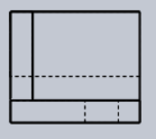
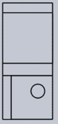
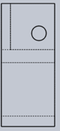

**Pre-test:**

Q1.If the isometric projection of an object is drawn with true
    length the shape would be the same and the size is how much larger
    than the actual isometric projection?
A.**25%**
B.**29.5%**
C.**22.5%**
D.**33.3%**

**Ans: C**

Q2 **.If an isometric projection is drawn with true measurements but
    not with isometric scale then drawing are called
    \_\_\_\_\_\_\_\_\_.**
A**.Isometric projection**
B**.Isometric view**
C**.Isometric perception**
D**.Orthographic view**

**Ans: B**

Q3**.If isometric drawing is made use of isometric scale then drawing
    is called \_\_\_\_\_\_\_\_\_.**
A**.Isometric projection**
B**.Isometric view**
C**.Isometric perception**
D**.Orthographic view**

**Ans: A**

Q4**. Identify the front view of the give projection.**

A**.**

B **.**

C**.**

D**.**

**Ans: A**

**Q5. Identify the top view of the given projection.**

A**.**

B **.**

C**.**

D**.**

**Ans: D**
