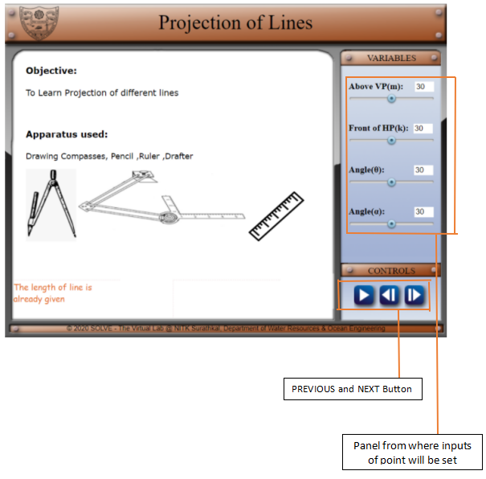
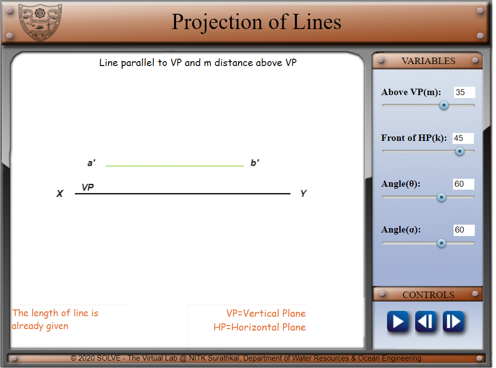
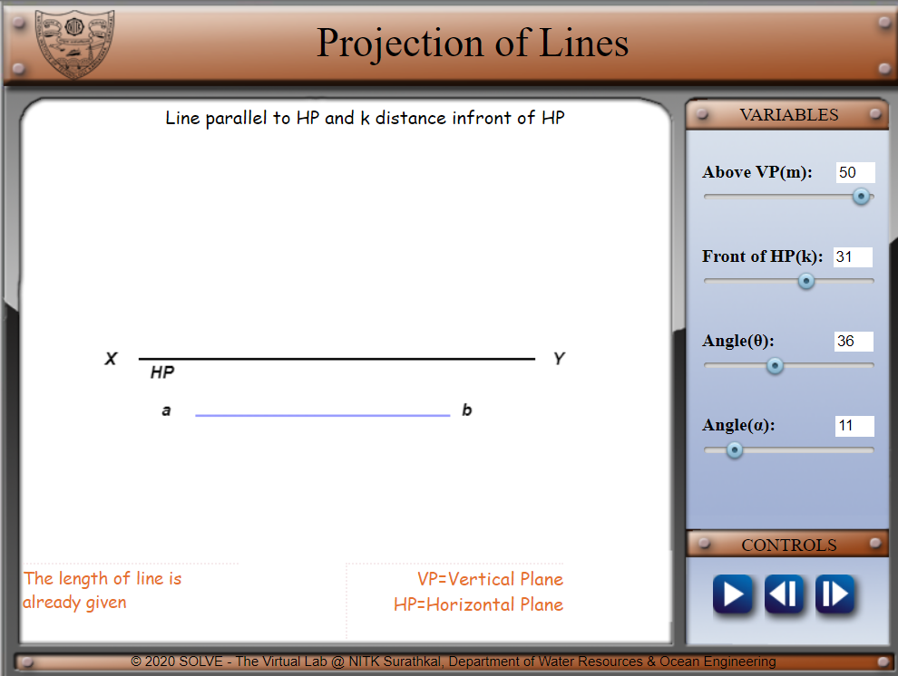
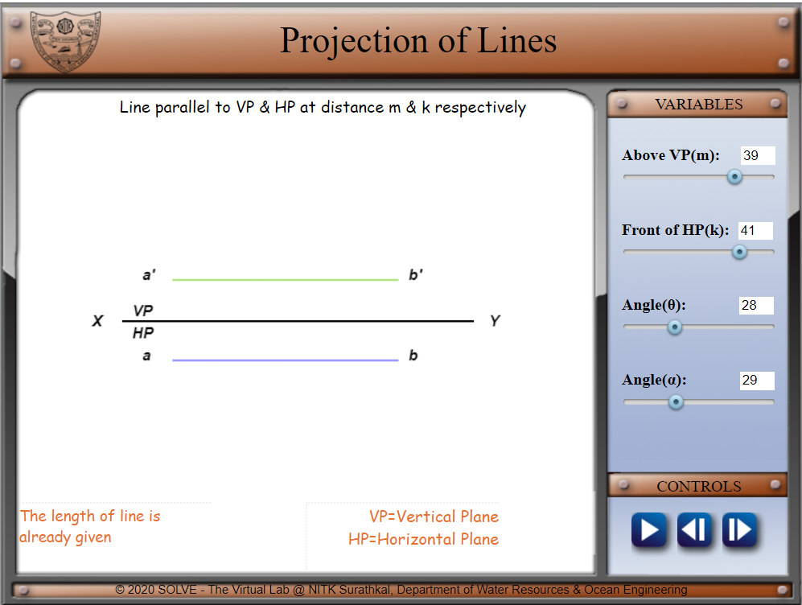
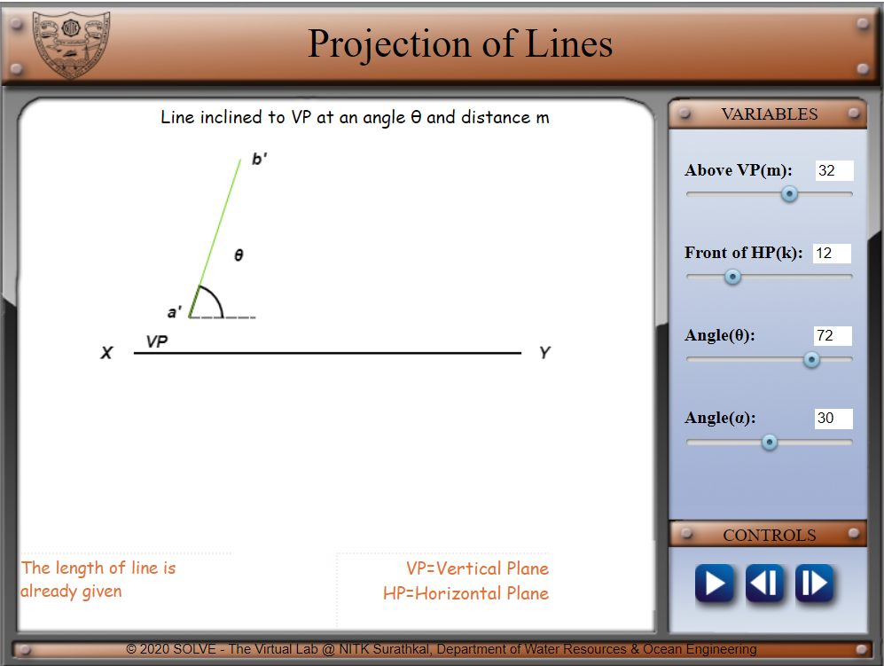
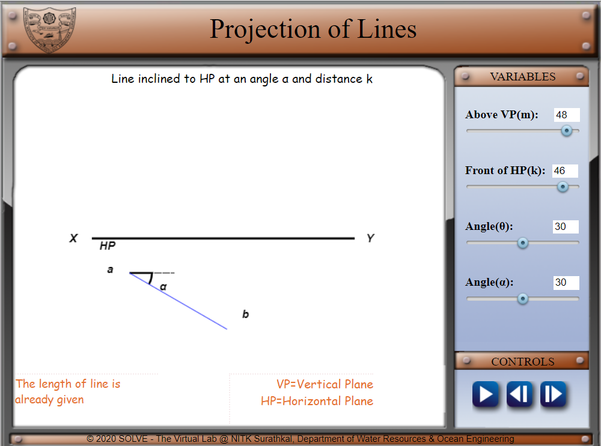

 * Click on **“Projection of Lines”** the following window will open. Click on
    **the NEXT** button to proceed.

  * On the right side, The variables can be altered, and then click on
     for the projection.

* Follow the same procedure, Use the buttons inside the control box as follows:

 to go to the previous
projection.

 to go to next projections

 to redraw the projection.

* The following are the various projections:

*Line parallel to HP and k distance Infront of HP*

*Line parallel to VP & HP at distance m & k respectively*

*Line inclined to VP at an angle θ and distance m*

*Line inclined to HP at an angle α and distance k*
