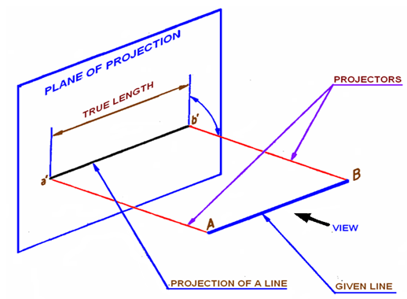
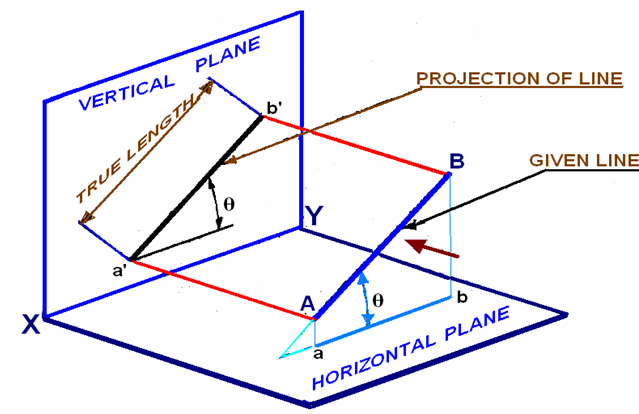
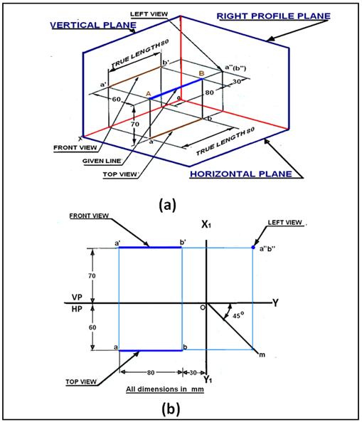
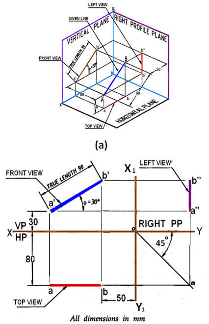

**THEORY:**

Conventions:

-   The naming of the front view always contains a dash sign i.e: a’

-   But the naming of the top view will just simple by any letter.

-   The angle is made by a given line in front view with HP called alpha and
    theta is the angle made by a true length with HP.

-   Angle made by given line in top view with VP is called beta and phi is the
    angle made by the true length with VP

-   Dimensioning is always required

Straight Line: It is a geometric primitive that has length and direction but no
thickness. It is the locus of a point, which moves linearly or the shortest
distance between any two points.

Location of a Line: The location of a line in a projection quadrant is described
by specifying the distance of its endpoint from VP, HP, or PP.

Projection of Line:

The projection of a line can be obtained by projecting its endpoints on planes
of projections and then connecting the points of projections. The projected
length and inclination of a line can be different compared to its true length
and inclination. The line may be:

-   Parallel to both the planes.    

 

-   Parallel to one plane and perpendicular to another plane.

 

-   Parallel to one plane and inclined to another plane.

-   And last inclined to both the planes.

source: https://nptel.ac.in/courses/112/103/112103019/

