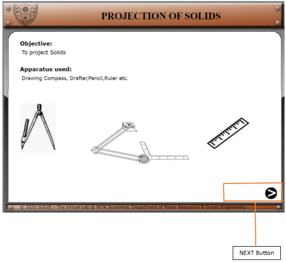
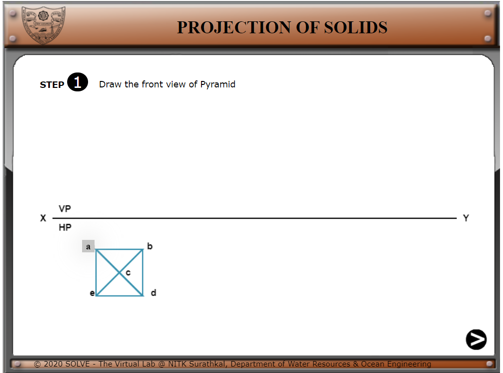
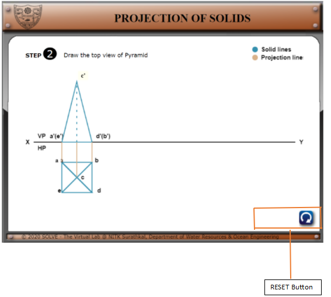
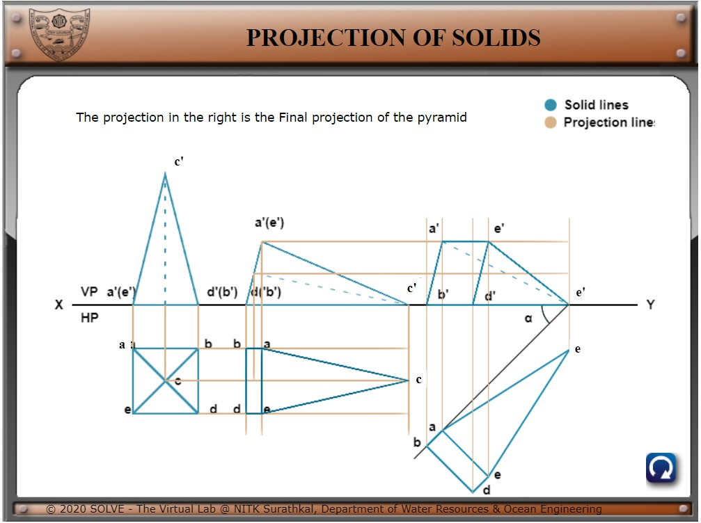

**PROCEDURE**

1).  Click on **“Projection of Lines”** the following window will open.
Click on **the NEXT** button to proceed.

****  

2). By Pressing the Button highlighted you can proceed to the next
step of construction.  
Hereby pressing a We proceed to Step 2.  

3). Here similarly by pressing c’ we proceed to step 3.  
In the right-hand corner, a Reset button** 
**gets active here.**

4). Finally, after following all the steps, we reach the final
projection.

5). At any step in between, if the Reset button
 gets clicked, the whole board resets to
this.

