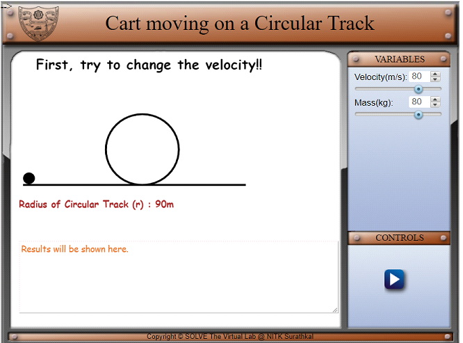
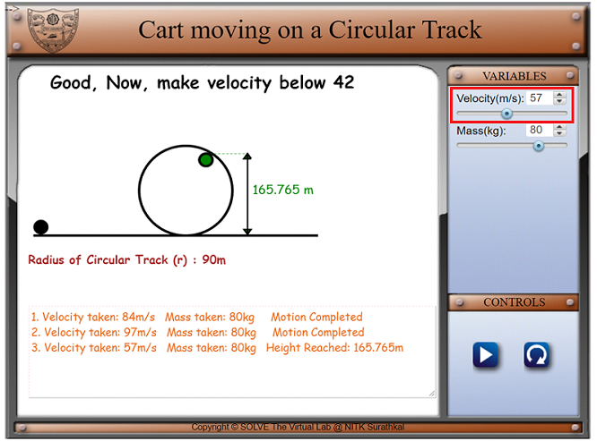
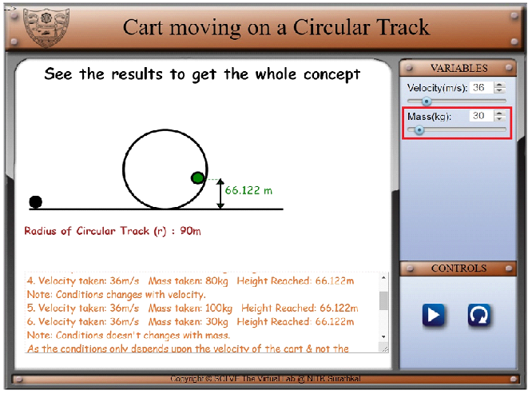
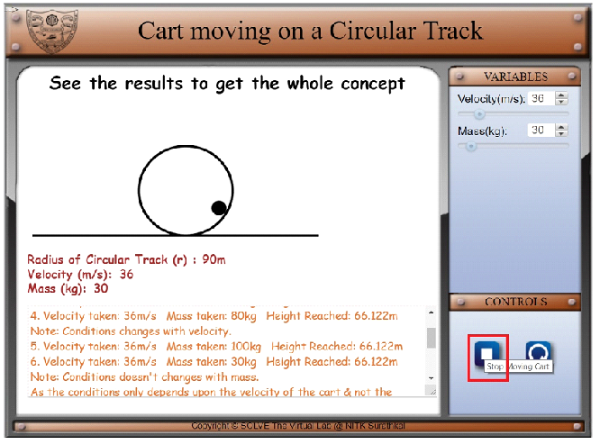

#### These procedure steps will be followed on the simulator

1. In simulation window a cart on a circular track is displayed.

2. Vary the velocity using slider.

3. Vary the mass using slider.

4. Press stop button to find velocity and height reached at any point

5. Find results and concept in result section.

