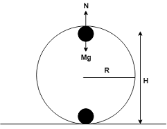
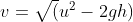

## INTRODUCTION 

#### User Objectives and Goals:

1. Identify the motion of a cart moving on a circular track as vertical circular motion rather than uniform circular motion.
2. To understand the mechanism behind cart moving on a circular track and visualize the analogy to an roller coaster.
3. To understand the variation in the motion of cart by changing the velocity of the cart.
4. To  understand the variation in height for different values of velocity.
5. To understand that velocity and height reached by cart at any point is independent of mass.
6. To observe the velocity and height reached by cart at any point on the circular track.

#### Theory
Uniform Circular motion can be described as motion of an object in a circle at a constant speed. At every point of the motion the object changes its direction. Therefore we can say that in order to move in uniform circular motion the object should change its direction. Newton’s first law motion tells us that there can be no acceleration. So there must be a force associated with circular motion. So we can say that a net force acts on the object which helps to change the direction of it continuously this force is known as centripetal force. It points towards the centre around which the body is moving.

In uniform circular motion the centripetal force acting towards centre is always constant. But that isn’t the case always. Think you are sitting in a roller coaster moving in vertical circle motion you will feel that roller coaster slows down at top and speeds up at the bottom; the amount of force applied is constantly changing this happens because normal on the cart at the topmost point , bottom point and at any point on the circle acts in different direction resulting in change in velocities.

#### Equations/formulas:

  

M = mass of the cart(kg)    
N = Normal reaction(N)  
v = Velocity of the cart(m/s)  
R = Radius of the circular track (m)  
g = gravitational acceleration (m/s2)      
H = Height reached by cart (m)  

**Vmin to complete the circular track:**

Applying energy conservation,  
At bottom:

1/2mvmin2 + mgh      (h=0)        -(i)

  

At h=R:

1/2mv2 + mgH       (v=0) (H=R)  - (ii)

Using (i) & (ii) ,

Vmin = 

  

**For cart to reach between H=2R and H=R**:   

Velocity conditions:

  
 <= v <= 

**For height reached by cart at any point**:

1/2mv2=2gh  
h=v2/2g

**For velocity of cart at any point**:

u = initial velocity  
v = velocity at any point  
h = height reached at point

Using energy conservation,  

1/2mu2 = 1/2mv2+ mgh  

