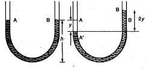
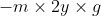
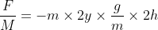
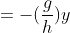
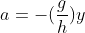
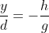
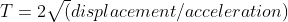
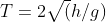

## INTRODUCTION 

#### User Objectives and Goals:

1. Identify different parameters of the experiment.
2. Understand the concept of simple harmonic motion.
3. Analysis of the change in displacement due to pressure and density.
4. Analyse theoretical relation between acceleration and displacement.
5. Visualise and observe the change in diameter of U-Tube and length of fluid in the tube.

#### Theory
The main aim of this experiment is to understand the concept of simple harmonic motion of liquid columns in a U tube with respect to the time, The working of set up consist of a U shaped tube being loaded up with an obscure liquid and the limbs of the u tube are opened at both ends , the known pressure-(P1) is applied at one end of the tube and the fluid filled in the tube rises in the other limb of the tube. As the applied pressure is suddenly removed the fluid in the rised end falls and the other side rises and vice versa, this motion occurs as the simple harmonic motion. The set up works on the principle of simple harmonic motion. The user can change the cross-sectional area of the U-Tube, level of fluid in the U tube, density of the fluid & the pressure to be applied on the left limb, The system henceforth calculates the displacement of the fluid with reference to the 0 pressure line, Time period of oscillation & also the frequency of the oscillation.

#### Equations/formulas:
**Vertical oscillations of a liquid column in a U-Tube**

Mass per unit length =   
Total mass of liquid =   
Restoring force =    
a(acceleration)=        
where mass and g get cancelled   

  

  

 a is proportional to -y  
 **Follows simple harmonic motion**  
 

   
 

T = time period  

  

