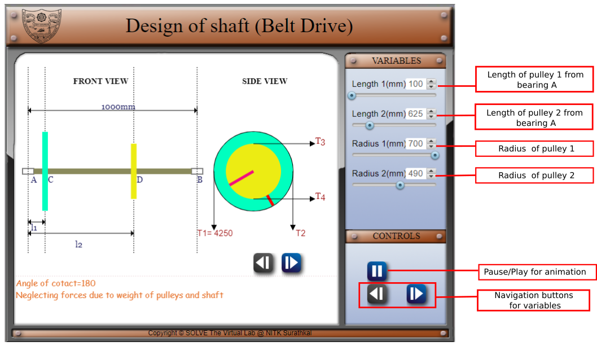
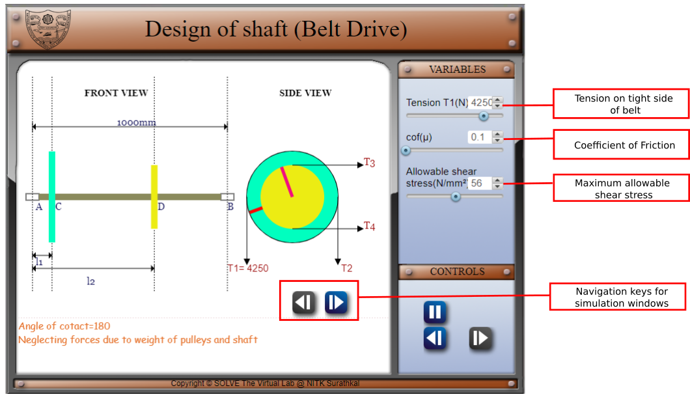
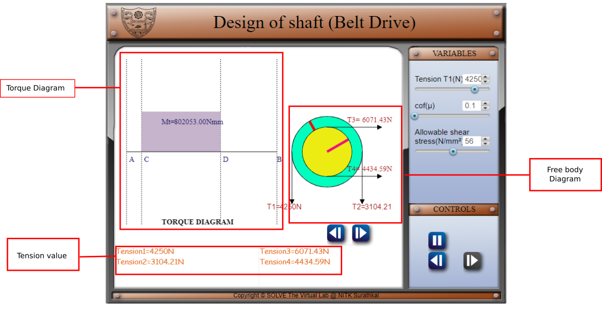

#### These procedure steps will be followed on the simulator

1. In the simulation window, the front view and side view of a rotating shaft with pulley are displayed. In bottom of simulator window values and assumption for calculation is given

2. There are pointers given on right side of the screen for choosing the values of input variables, viz., length of pulley 1 and 2 from bearing A, and radii pf pulley, after choosing these input variable move to next variable screen using navigation buttons and choose value for tension, coefficient of friction and maximum allowable shear stress. after choosing variable move to next screen using navigation keys.

3. In the next screen Torque diagram, maximum torque, free body diagram and tension on pulley belt is displayed. click on navigation keys to change screen.

4. In the next screen Vertical bending moment diagram, vertical load diagram and vertical bending moment at points is displayed. click on navigation keys to change screen.

5. In the next screen Horizontal bending moment diagram, Horizontal load diagram and vertical bending moment at points is displayed. click on navigation keys to change screen.

6. In the next screen resultant bending moment diagram, resultant load diagram and resultant bending moment at points, calculated diameter and standard diameter is displayed.

 
