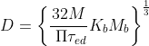

## INTRODUCTION 

#### User Objectives and Goals:

1. Explain the reason for design of shaft
2. Describe the steps to be followed to calculate the dimension of shaft
3. Calculate forces acting on the shaft due to gear drive
4. Sketch the Free body diagram and bending moment diagram of the shaft under load
5. Calculate forces acting on the shaft, bending moment on the shaft and dimension of shaft.
6. Examine and compare the calculated value with the simulation.

#### Theory

Shaft is a straight bar usually of circular cross-section. Shafts are used to transmit power from motor to compressor, turbine to generator, motor to pump and so on. The shaft may be hollow or solid. The shaft is supported on bearings and it rotates a set of gears or pulleys for the purpose of power transmission. The shaft is generally acted upon by bending moment, torsion and axial force. Design of shaft primarily involves in determining stresses at critical point in the shaft that is arising due to aforementioned loading
 
 
<u>DESIGN FOR STRENGTH AND RIGIDITY WITH STEADY LOAD</u>

Design of a shaft involves the determination of diameter in the case of solid shaft. inner and outer diameter in the case of hollow shaft. Two criterion generally used for this purpose areStrength criterion and  Rigidity criterion.

<li><u>Strength criterion</u></li>
Torsional strength is defined as the torque per unit maximum shear stress. Based on this, the maximum shear stress induced on the outer surface should not exceed the allowable value Therefore the formula used for this criterion
 

 
</ol>
<li><u>Rigidity criterion</u></li>
Torsional rigidity is the torque required to produce a unit angle of twist in a specified length of the shaft. According to this Criterion the diameter of the shaft determined, based on the value of the limiting angle of Twist  .The formula used for this purpose is

 

 

<u>Properties of shaft material</u>

The material to be selected for shaft should possess the following properties
* High strength
* Low notch sensitivity factor
* Good machinability
* Less prone to Environmental effects
* Wear resistant
* Good heat treatment properties

The materials commonly used foe shafts is mild steel, when high strength is required alloys of steel such as nickel, nickel chromium or chrome vanadium steel is used.

<u>ASME code for design of shaft</u>

The ASME code for design of shaft is based on maximum shear stress theory and takes into account the effect of fatigue and shock by introducing two factors into equation of maximum shear stress theory i.e,  and  .Where =combined shock and fatigue factor for bending and  =combined shock and fatigue factor for torsion. Hence ASME code for diameter of shaft is

 
</ol>

where

the vlaue of and  are given by following table

 

ASME code also suggests about the allowable design stress, to be considered for steel shafting,

ASME Code for steel purchased under definite specifications = 
 		30% of the yield strength but not over 18% of the ultimate strength in tension for shafts without key ways. These values are to be reduced by 25% for the presence of key ways.

<u>Forces acting on the shaft due to gear drive</u>
<ol type="i">
<li>If the driver pinon is vertically below and rotates in clockwise direction

   

<li>If the driver pinon is vertically below and rotates in anti-clockwise direction.

   

<li>If the driver pinon is placed horizontally and rotates in clockwise direction.

 

<li>If the driver pinon is placed horizontally and rotates in anti-clockwise direction.

 

</ol>

<u>Standard shaft sizes</u>

Standard shaft diameter are typically selected from the table given below

 

#### Equations/formulas:

=Diameter of the shaft

=Endurance limit stress

=Combined shock and fatigue factor in bending

=Combined shock and fatigue factor in torsion

=Maximum torque due to twisting moment

=Modulus of rigidity

=Angle of lap

= power in kW

= speed of shaft

Maximum torque

 

  

For belt drive

  

Diameter of shaft Subjected to simple torsional

  

Diameter of shaft Subjected to simple bending

 

Diameter of shaft Subjected to combined bending and torsion.
According to maximum shear stress theory

   

Diameter of shaft based on torsional rigidity

 

