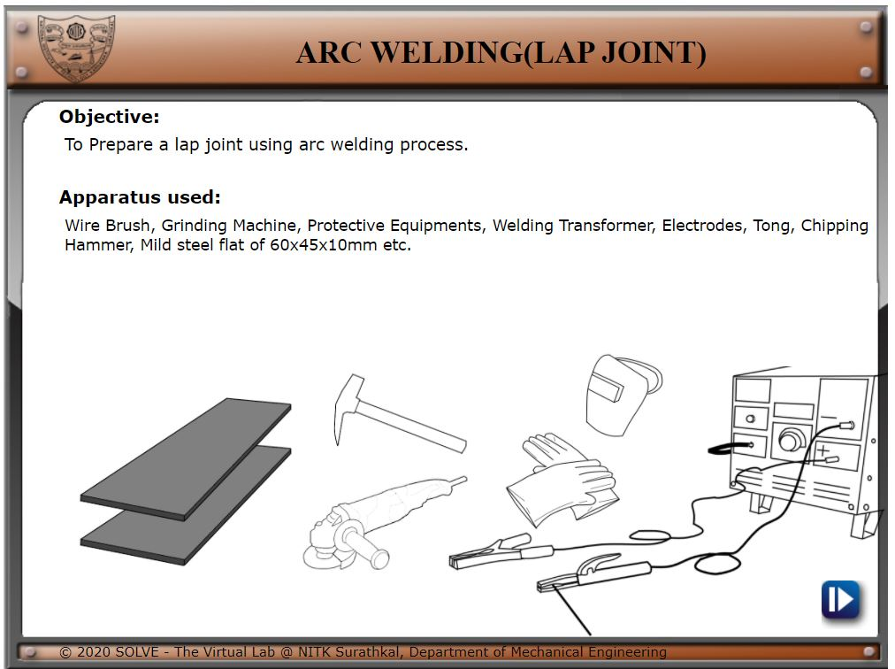
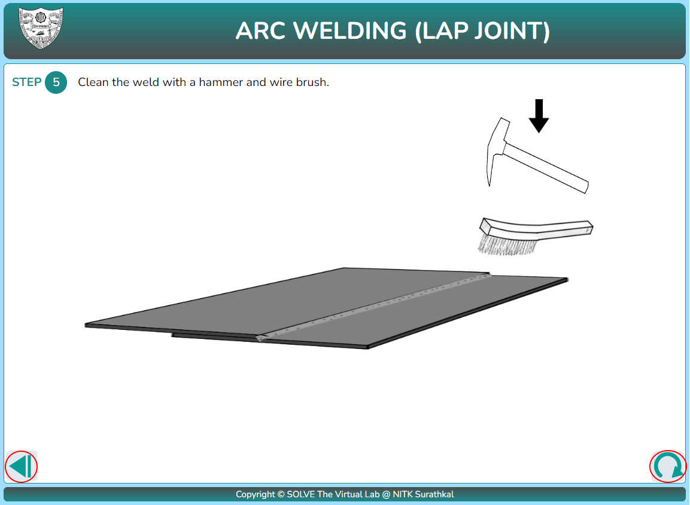
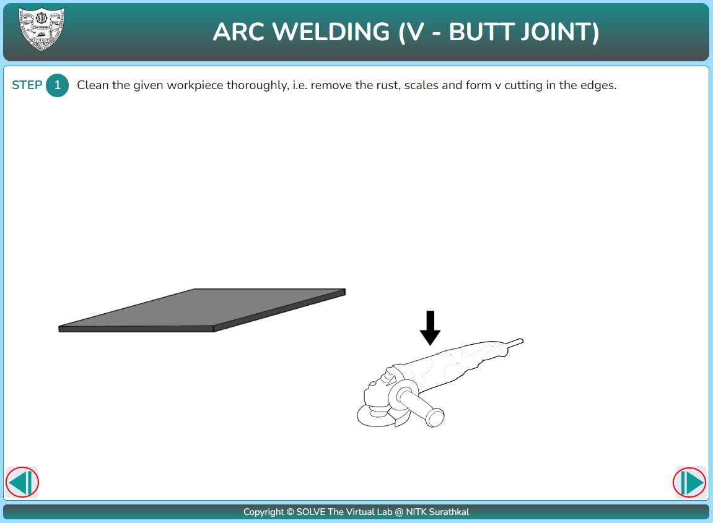
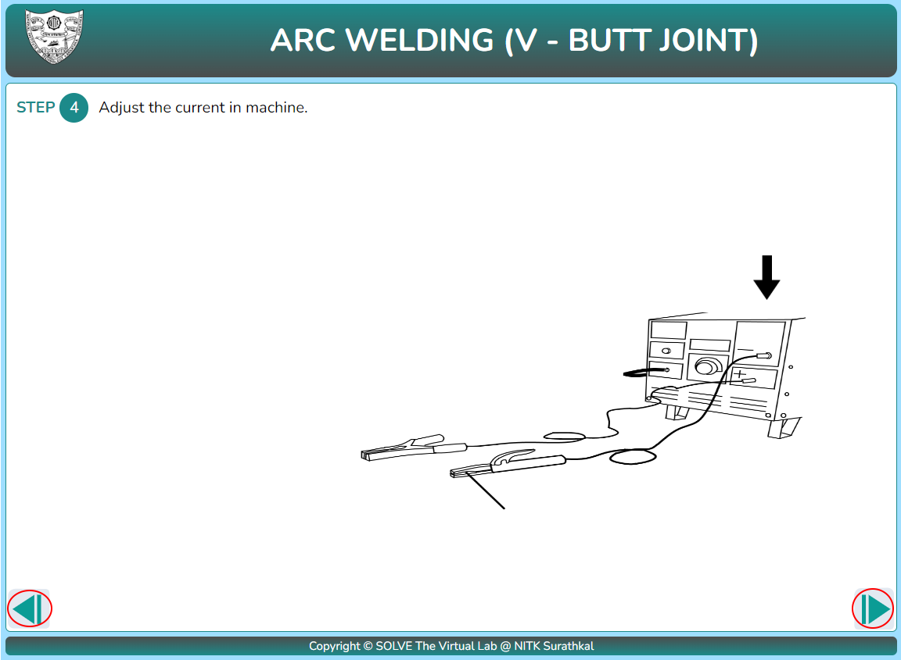

#### These procedure steps will be followed on the simulator

#### Lap Joint : </h5>

1. Click on Lap joint in simulation the following window will appear, click NEXT to proceed. 
    

2. Click on the grinder to file and clean the work-pieces. Click the next button after cleaning. 
    

3. Click on the workpiece to align it properly to form a lap joint and click next to proceed. 
    

4. Click on the welding machine to adjust the current and click next to proceed. 
    

5. Click on the electrode to start welding and click next to proceed. 
    

6. Click on the chipping hammer to chip off the scale formed and clean the final product. 
    

<h5> V-Butt Joint : </h5>

1. Click on the V-Butt joint in simulation the following window will appear, click NEXT to proceed. 
    

2. Click on the grinder to file and clean the work-pieces. Click the next button after cleaning to proceed. 
    

3. Click on the workpiece to align it properly to form a lap joint and click next to proceed. 
    

4. Click on the workpiece to turn it over and click next to proceed. 
    

5. Click on the welding machine to adjust the current and click next to proceed. 
    

6. Click on the electrode to make tack weld and click next to proceed. 
    

7. Click on the workpiece to turn it over and click next to proceed. 
    

8. Click on the electrode to start welding and click next to proceed. 
    

9. Click on the chipping hammer to chip off the scale formed and clean the final product. 
    
