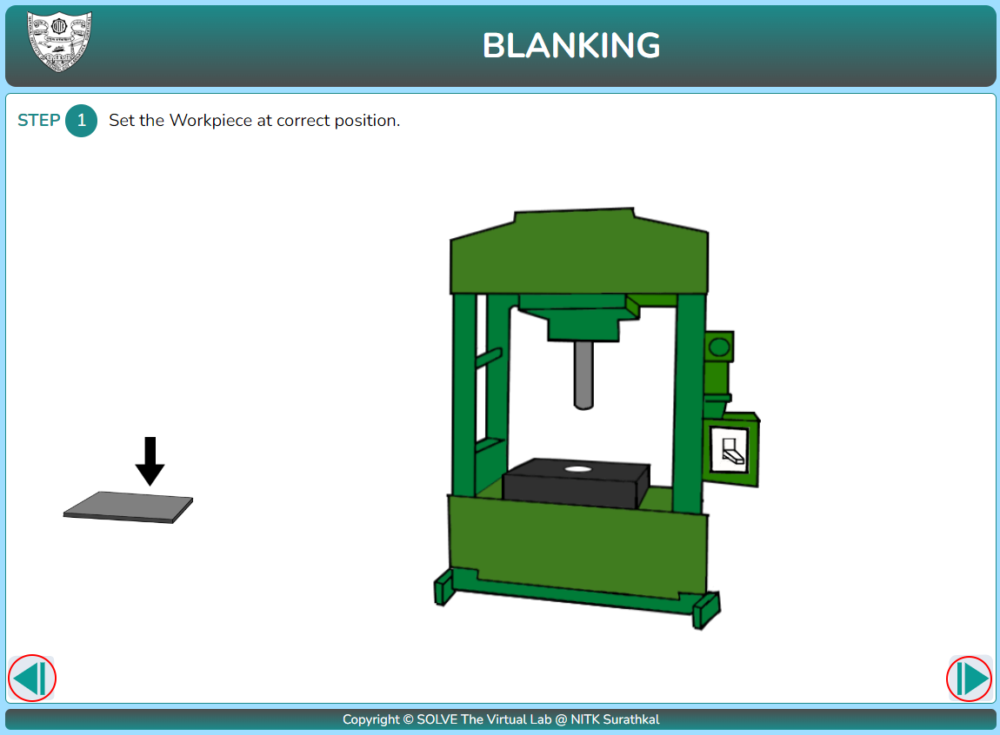
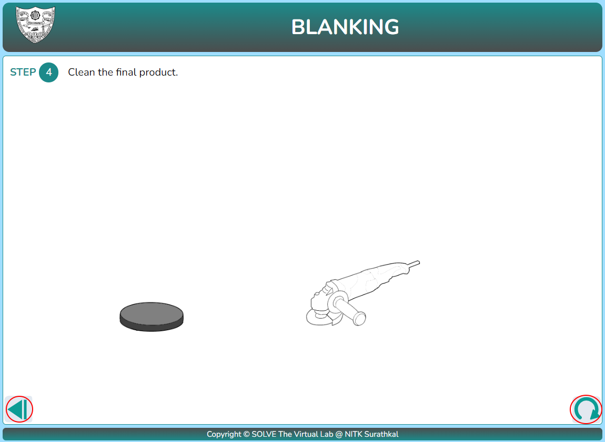

#### These procedure steps will be followed on the simulator

1. Click on piercing/blanking in simulation the following window will appear, click NEXT to proceed.

2. Click on the workpiece to position on machine. Click next button after positioning.

3. Click on the machine to turn it on and click next to proceed.

4. Click on the metal sheet to take products out and click next to proceed.

5. Click on the grinder to do the finishing works.

