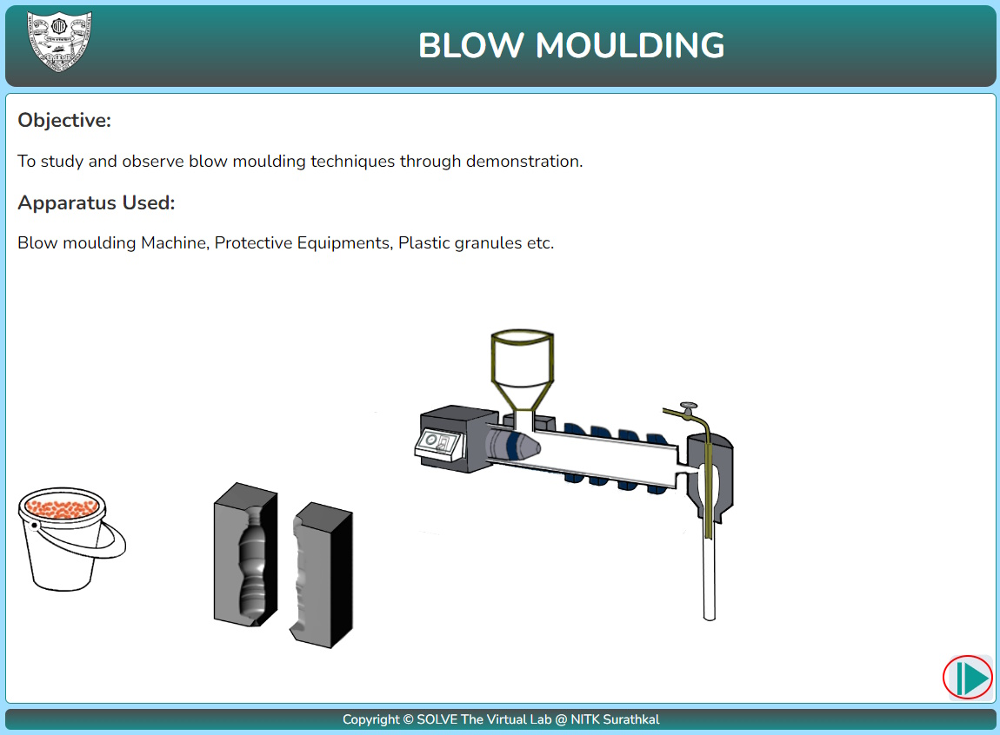
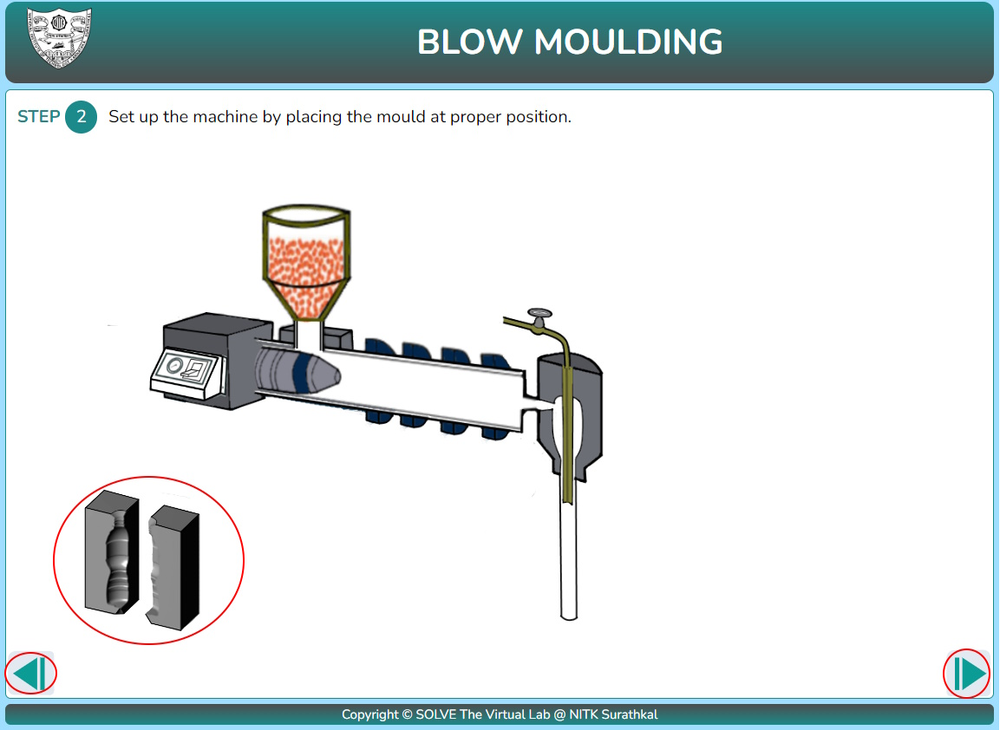

#### These procedure steps will be followed on the simulator

1. See the displayed objectives and apparatus used then click on the next button. 
 
<!--  -->

2. Click on the bucket with plastic granules and click next to proceed. 
 

3. Click on the mould to place it in position and click next to proceed. 
 

4. 
Click on the machine  to turn it on and click next to proceed. 
 

5. Click on the valve to start airflow and click next to proceed. 
 

6. Click on the mould to remove it and click next to proceed. 
 

7. Click on the bottle to collect the final product 
 
