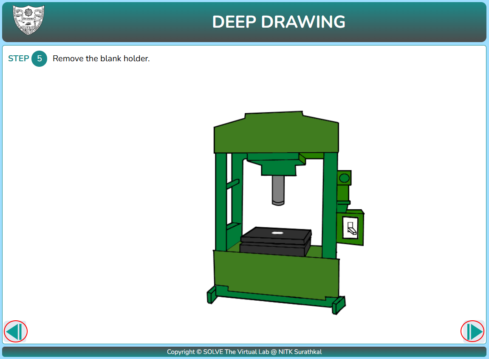

#### These procedure steps will be followed on the simulator

1. In simulation window the experimental setup of the deep drawing is shown, click NEXT to proceed.

   

2. Click on the blank to place it on the machine and click next to proceed.
   

3. Click on the blank holder to place it above the blank and click next to proceed.
   

4. Click on switch to apply force on the press and click next to proceed.
   

5. Click on the press to release it and click next to proceed.
   
6. Click on the blank holder to remove it from machine and click next to proceed.
   

7. Click on the cup to take out the finished product from the assembly
   
