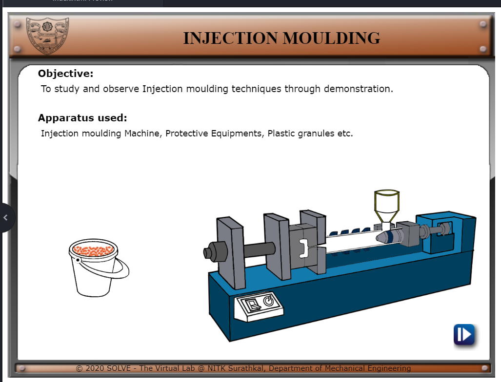
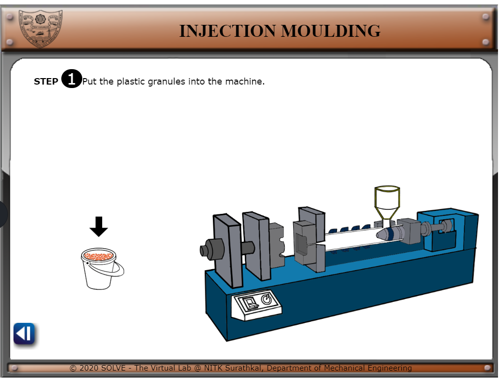
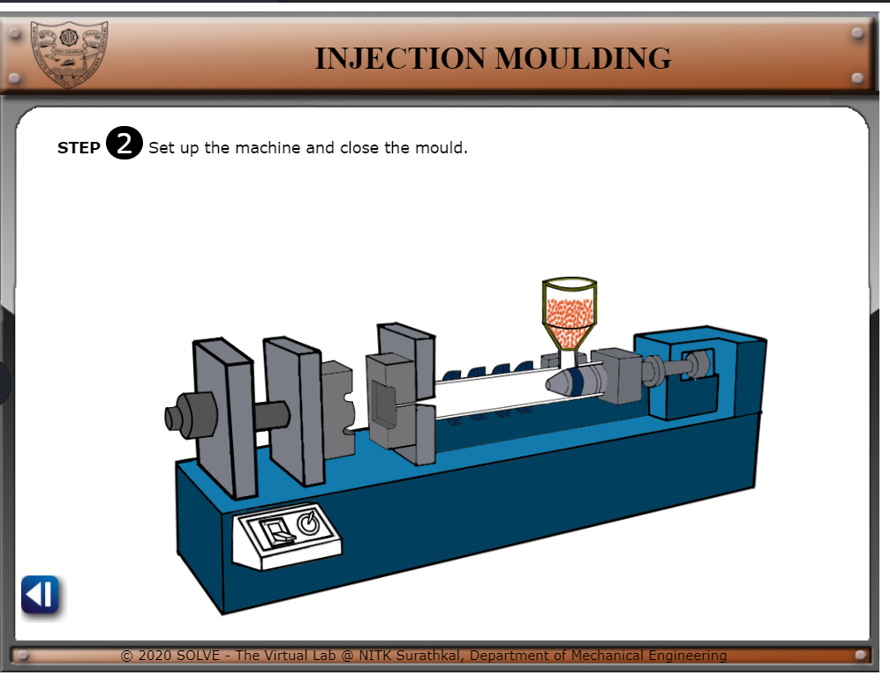
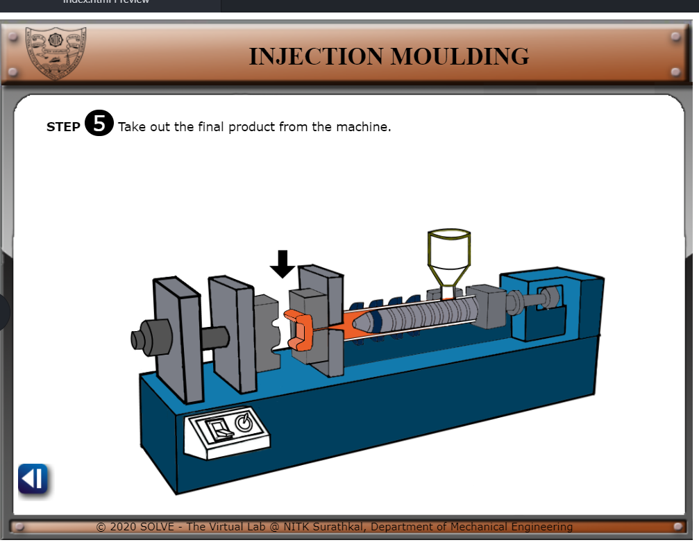

#### These procedure steps will be followed on the simulator

1. See the displayed objectives and apparatus used then click on the next button. 
 

2. Click on the bucket with plastic granules and click next to proceed. 
 

3.Rotate the dial so that granules enter into machine and click next to proceed. 
 

4. 
 When switch is on the screw moves towards the mould. The heating coil will melt the plastic and it is injected into mould and click next to proceed. 
 

5. Turn off the switch to open the mould once plastic is cooled  and click next to proceed. 
 

6.  Collect the final product 
 
