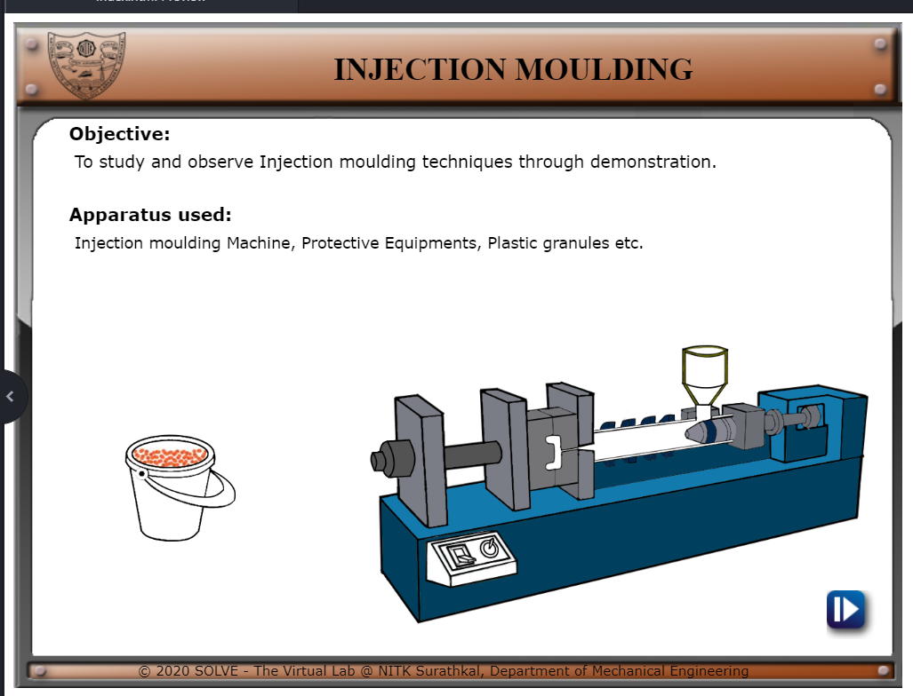
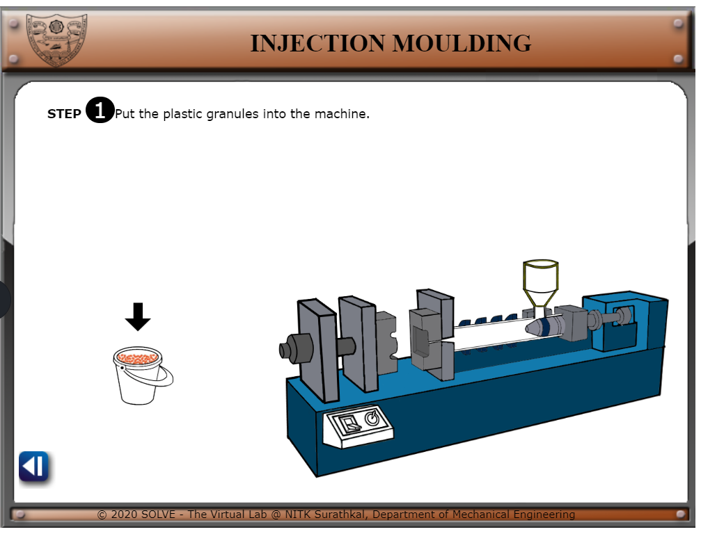
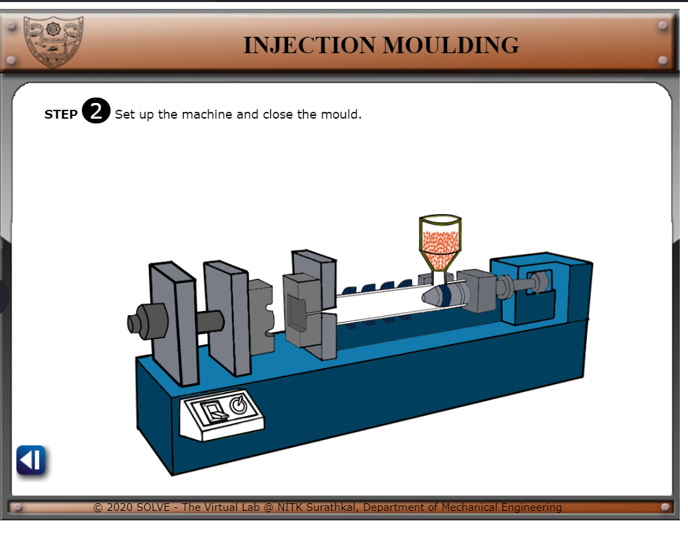
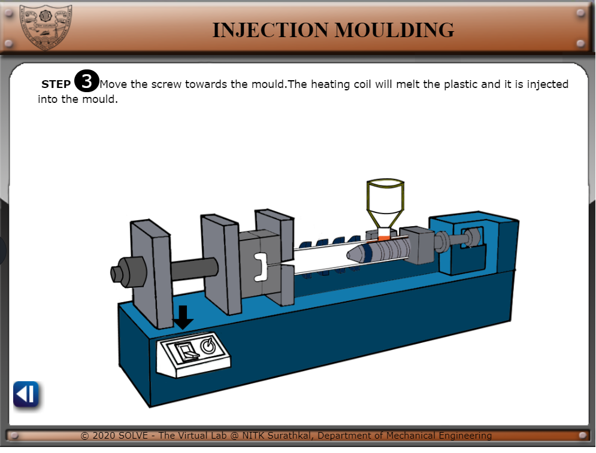
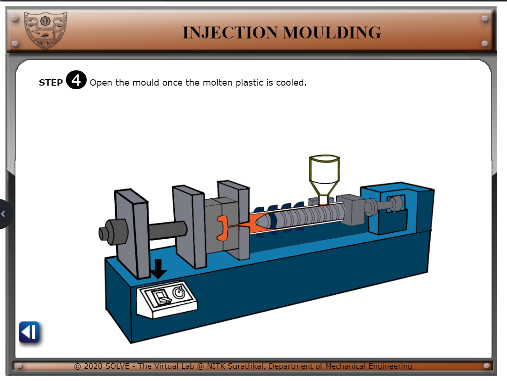
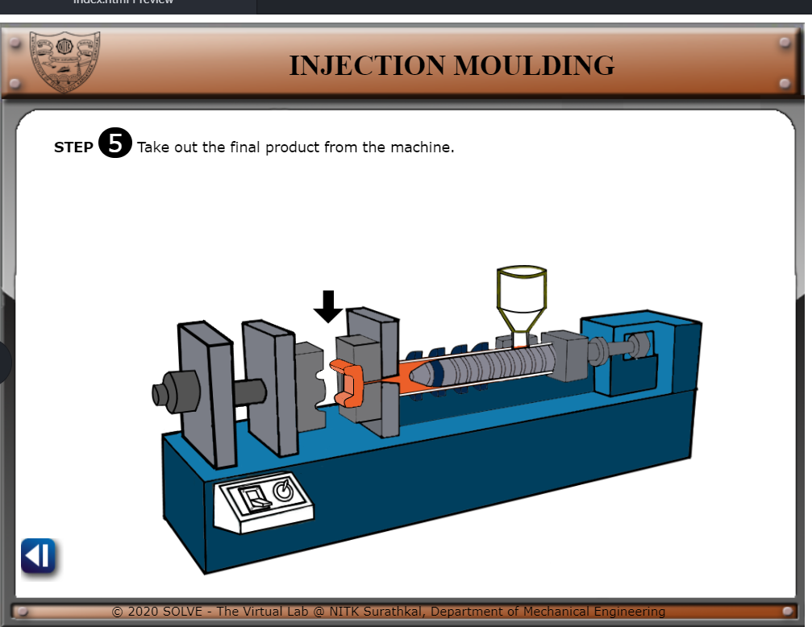

#### These procedure steps will be followed on the simulator

1. Click on sand casting following window will open, click NEXT button to proceed. 
 

2. Click on the pattern to place it inside drag box and proceed 
 

3. Click on bucket to pour sand in box ,click on the drag box to invert it and proceed  
 

4. Click on the cope box to place it on  drag box and proceed 
 

5. Click on pattern to place it inside cope box and proceed  
 

6.  6.	Click on bucket to pour sand in box and proceed  
 
7.	Click on top box to open the 2 boxes and proceed    
8.	Click on pattern to remove it from box and proceed      
9.	Click on box to clamp it back together and proceed    
10.	Click on metal rod to setup gate and sprue and proceed    
11.	Click on container to pour molten metal into cast system and proceed     
12.	Click on the box to open it  and click on the cast and take it outside the sand and proceed     
13.	Click on grinder to complete final finishing works.     
