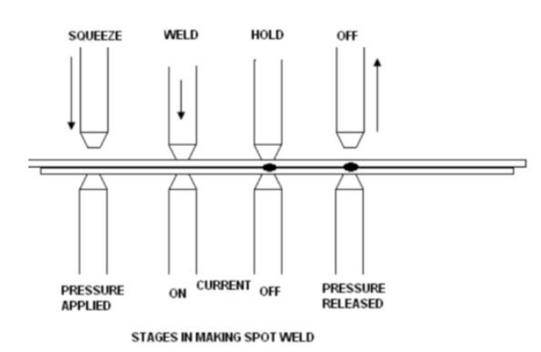

## INTRODUCTION 

#### User Objectives and Goals:

  1. State what are spot and friction welding processes
  2. Describe principles behind their working
  3. Compare Spot welding and Friction welding.
  4. Identify the materials that can be subjected to each process and situations in which they can be applied.

#### Theory

<b>Spot welding</b> is a resistance welding process in which overlapping sheets are joined by local fusion at one or more spots by the heat generated by resistance to the flow of electric current through work pieces that are held together under force by two electrodes, one above and the other below the two overlapping sheets.

 

In resistance welding (RW) a low voltage (typically IV) and very high current (typically 15,000 A) is passed through the joint for a very short time (typically 0.25 s). This high amperage heats the joint, due to the contact resistance of the joint and melts it. The pressure on the joint is continuously maintained and the metal fuses together under this pressure. The heat generated in resistance welding can be expressed as 

H = kI2RT
 

Where H = the total heat generated in the work, l = electric current, t = time for which the electric current is passing through the joint, r = the resistance of the joint, ohms and k = a constant to account for the heat losses from the welded joint. The resistance of the joint, R is a complex factor to know because it is composed of
1. The resistance of the electrodes,
2. The contact resistance between the electrode and the work piece,
3. The contact resistance between the two work piece plates,
4. The resistance of the work piece plates. 

The amount of heat released is directly proportional to the resistance. It is likely to be released at all of the above-mentioned points, but the only place where a large amount of heat is to be generated to have an effective fusion is at the interface between the two work piece plates. Therefore, the rest of the component resistances should be made as small as possible, since the heat released at those places would not aid in the welding. Because of the squaring in the above, equation, the current, 'i' needs to be precisely controlled for any proper joint. The main requirement of the process is the low voltage and high current power supply. This is obtained by means of a step down transformer with a provision to have different tappings on the primary side, as required for different materials. The secondary windings are connected to the electrodes which are made of copper to reduce their electrical resistance.

The time of the electric supply needs to be closely controlled so that the heat released is just enough to melt the joint and the subsequent fusion takes place due to the force (forge welding) on the joint. The force required can be provided either mechanically, hydraulically or pneumatically. To precisely control the time, sophisticated electronic timers are available. The critical variable in a resistance welding process is the contact resistance between the two work piece plates and their resistances themselves. The contact resistance is affected by the surface finish on the plates, since the rougher surfaces have higher contact resistance. The contact resistance also will be affected by the cleanliness of the surface. Oxides or other contaminants if present should be removed before attempting resistance welding.

 

<b>Friction welding</b> is a solid-state joining technique that welds workpieces by generating heat through mechanical friction. The induced mechanical motion of friction welding generates heat, causing the materials to be joined to soften and become viscous. While in the softened state, the mechanical motion of the process mixes the materials to create a bond. The way by which the frictional heat and material mixing occur is very dependent on the friction welding process utilised, of which there are four primary processes: Friction stir welding (FSW), friction stir spot welding (FSSW), linear friction welding (LFW) and rotary friction welding (RFW).

Rotary friction welding (RFW) is a solid-state joining process which works by rotating one workpiece relative to another while under a compressive axial force. An inertia machine looks much like a conventional shop lathe. In a chuck attached to a flywheel of precisely measured mass, the machine holds one part for welding. A non-rotated chuck that moves axially under hydraulic pressure holds the other.

 

The machine spins part and flywheel to a predetermined speed, providing the inertia needed for welding, and then releasing them from the drive mechanism. At the same time, hydraulics move the non-spinning part forward, pressing it against the spinning part. Friction heats the contacting surfaces and slows part and flywheel until, having spent the kinetic energy in the flywheel, they stop. Increased hydraulic pressure pushes the heat-softened parts together until they cool, welded together. Precise rotational speed and hydraulic pressure govern the rate of heat buildup and rate of compression of the joint for process repeatability.

The main steps involved in the process are:
1. <b>Pre Contact:</b> One workpiece is fixed in a stationary holding device. The other, clamped in a spindle chuck, usually with attached flywheel, is accelerated rapidly.

 

2. <b>Friction:</b> Once the flywheel reaches a predetermined speed, one part is thrust against the other piece.
Friction between the parts decelerates the flywheel, converting stored energy to frictional heat –
enough to soften, but not melt, faces of the parts.

3. <b>Forge:</b> Just before rotation ceases, the two parts bond. Remaining flywheel energy hot works the metal
interface, expelling any impurities or voids and refining grain structure.

4. The weld is complete when the flywheel stops.

Here we are demonstrating both friction and spot welding separately. Spot welding is mainly used to join two flat workpieces. First, the workpieces are cleaned and placed at proper positions to form the joint. Then pressure is applied on specific points using the spot welding machine. After the process is done the workpiece is cleaned properly.

Friction welding is mainly used to join two cylindrical workpieces. After cleaning and filing the edges the workpieces are properly placed on the machine. The setup of the machine is such that one workpiece will rotate and the other one which is placed linear will come close to the rotating piece and touches it. Once it touches it will create a frictional force which results in heating of the joint, Thus the two pieces are joined together.
