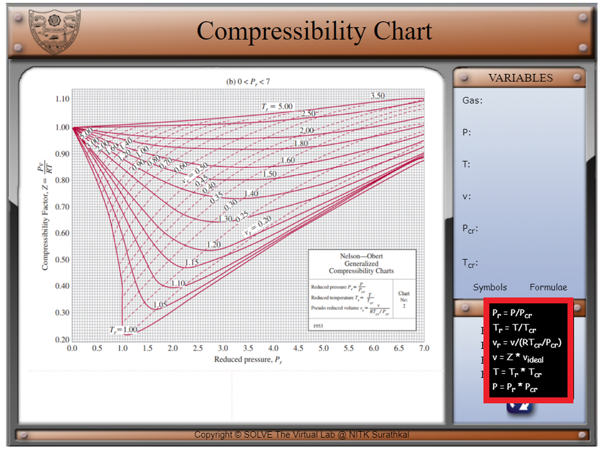
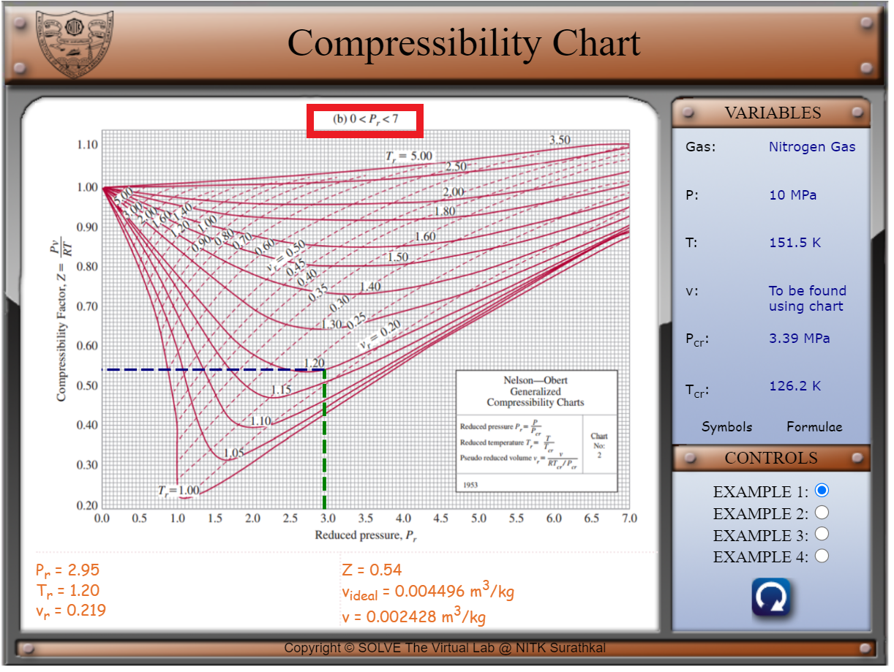
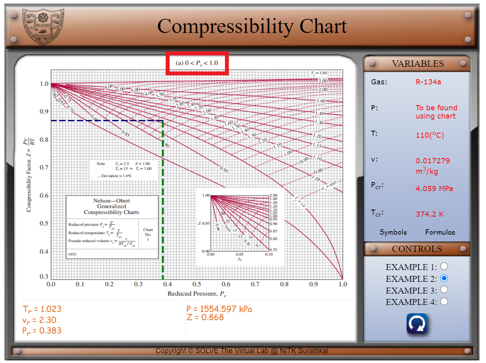
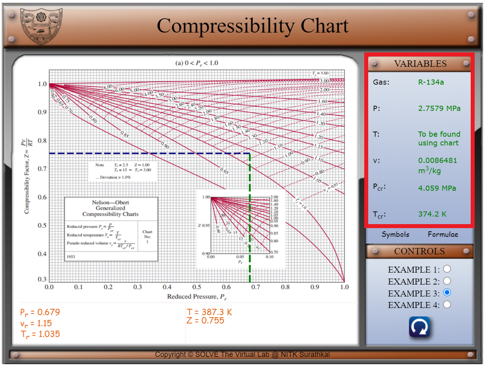
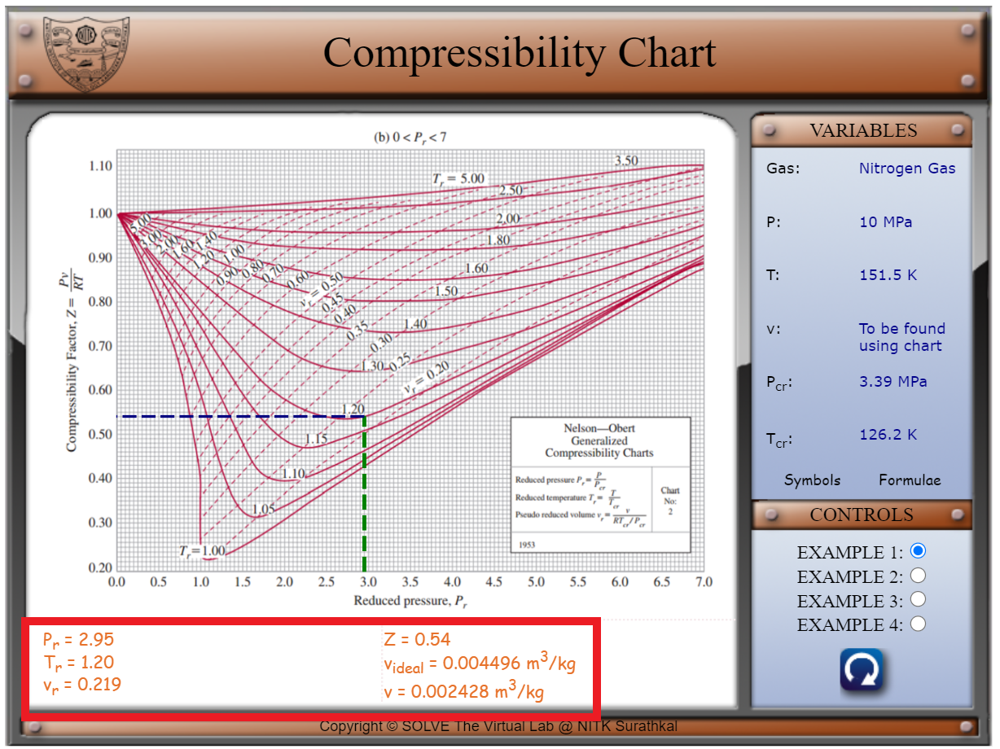

#### These procedure steps will be followed on the simulator

1. In the simulation window, the Nelson-Obert generalized compressibility chart for 0<Pr<7 is visible.
2. One of the four examples can be selected using the radio buttons, as shown below.

 
3. The various symbols and the formulae involved in the experiment are displayed in the control panel when the cursor hovers over ‘Symbols’ and ‘Formulae’ respectively.

 

 
4. The graph changes as different examples are selected, depending on whether the value of Pr is greater than or lesser than 1. 

 

 

5. The gas used, the values of four properties as well as which quantity is to be found, is displayed in the ‘VARIABLES’ panel.. 
The various symbols and the formulae involved in the experiment are displayed in the control panel when the cursor hovers over ‘Symbols’ and ‘Formulae’ respectively.

 

6. Properties including Tr (reduced temperature), Pr (reduced pressure), vr (pseudo-reduced specific volume), the unknown quantity which is to be found and the compressibility factor Z are displayed at the bottom. When the unknown quantity is v, videal (specific volume of the gas obtained from the ideal-gas equation) is also displayed at the bottom.

 
