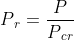

## INTRODUCTION 

The compressibility factor (Z) is a correction factor. The magnitude of Z for a certain gas at a particular pressure and temperature gives an indication of deviation of the gas from ideal gas behaviour.

#### User Objectives and Goals:

1. Understand and learn to read the Nelson-Obert generalized compressibility chart.
2. Visualize the method to read the graph with the help of the animated dotted lines drawn on the graph.
3. Analyze the method used to find out the unknown quantity with the help of the formulae given in the formulae tab.
4. Calculate any two of the reduced pressure, reduced temperature and reduced volume (depending on which of the three quantities among pressure, temperature and volume are known).
5. Calculate the final unknown quantity (pressure, temperature or volume).
6. Observe the effect of the gas used and the change in the values of P, v, T on the compressibility factor Z.
7. Observe the usage of different kinds of graphs for different values of reduced pressure.

#### Theory

The compressibility factor (Z) is a correction factor. The magnitude of Z for a certain gas at a particular pressure and temperature gives an indication of deviation of the gas from ideal gas behaviour.

For a particular gas, the compressibility factor Z is a function of p (pressure) and T (temperature). The compressibility chart is made up of lines of constant temperature on coordinates of p and Z. Using this plot, Z can be determined for any value of p and T. A compressibility factor chart exists for each substance.

In this experiment, we use the Nelson-Obert generalized compressibility chart, in order to demonstrate how to read a generalized compressibility chart as well as how to use it to find unknown quantities like volume.

In order to use a compressibility chart, two of the three reduced properties (reduced pressure, reduced temperature, reduced volume) must be known. Then, the third unknown quantity can be obtained. In a compressibility chart, reduced pressure Pr and compressibility factor Z are on the x-axis and y-axis respectively. When given the reduced pressure and temperature, Z can be determined using the chart.  If any two values out of pressure, temperature and volume of the substance are known, then the third quantity can be found out using the compressibility chart.

#### Abbreviations:

  1. P = Actual pressure of the
  2. T = Actual temperature of the gas
  3. v = Actual Specific volume of the gas
  4. Pcr = Critical pressure of the gas 
  5. Tcr = Critical temperature of the gas
  6. Pr = Reduced pressure of the gas
  7. Tr = Reduced temperature of the gas
  8. vr = Pseudo reduced specific volume of the gas
  9. videal = Specific volume of the gas obtained from the Ideal gas equation
  10. Z = Compressibility factor
  11. R = Gas constant
  12. Gas constant of Nitrogen, R = 0.2968 kJ/kg.K
  13. Gas constant of R-134a, R = 0.08149 kJ/kg.K
  14. Gas constant of Superheated water, R = 0.4615 kJ/kg.K

#### Equations/formulae:

 

 

 

 

 

