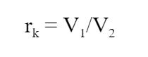
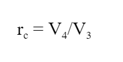
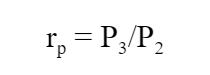
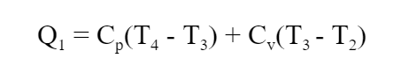
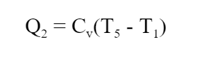
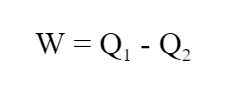
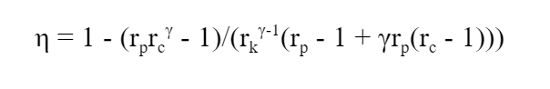

## INTRODUCTION 

Dual cycle is a thermodynamics cycle developed by the engineer Gustav Trinkler. It is a combination of the Otto cycle used for SI engines and the Diesel cycle used for CI engines. In this cycle, the combustion takes place partially over an isochoric process and partially over an isobaric process to ensure that the fuel combustion takes place completely.

#### User Objectives and Goals: 

1. Understand the various processes involved in the Dual cycle.
2. Portray the change in the graph as the parameters are changed.
3. Calculate the compression ratio, cut-off ratio and the pressure cut-off ratio.
4. Calculate the heat added, work done and the heat removed.
5. Calculate the efficiency of the Dual cycle.

#### Theory 

Dual cycle is a thermodynamics cycle developed by the engineer Gustav Trinkler. It is a combination of the Otto cycle used for SI engines and the Diesel cycle used for CI engines. In this cycle, the combustion takes place partially over an isochoric process and partially over an isobaric process to ensure that the fuel combustion takes place completely.

The various processes involved are explained below:

1-2 - This is the isentropic compression phase, where the gas is compressed by the piston as it goes up.

2-3 - This is the constant volume heat addition, where the gas partially undergoes combustion. The pressure variation in this process is known as the explosion ratio.

3-4 - This is the constant pressure heat addition, where the combustion of the air-fuel mixture continues to take place. In this process, the piston moves towards V4 doing work. This is the power stroke.

4-5 - This is the isentropic expansion phase, where the gas is expanded adiabatically in a reversible manner as the piston moves towards the bottom dead centre, and the gas does work on the surroundings. This also contributes to the power stroke.

5-1 - This is the constant volume heat rejection phase, where the heat is rejected to the surroundings as the piston is at the bottom dead centre. The exhaust gases escape through the exhaust valve.

In this experiment, the Dual cycle is demonstrated so that the user can understand how the P-V graph changes as various pressure and volume parameters change.

#### Abbreviations: 

1. P1, v1, T1 = Pressure, volume and temperature values at the beginning of Process 1-2
2. P2, v2, T2 = Pressure, volume and temperature values at the beginning of Process 2-3
3. P3, v3, T3 = Pressure, volume and temperature values at the beginning of Process 3-4
4. P4, v4, T4 = Pressure, volume and temperature values at the beginning of Process 4-5
5. P5, v5, T5 = Pressure, volume and temperature values at the beginning of Process 5-1
6. γ = Heat capacity ratio (adiabatic index) = 1.4
7. Cp = Specific heat of air at constant pressure = 1.005 kJ/kg.K
8. Cv = Specific heat of air at constant volume = 0.718 kJ/kg.K
9. rk = Compression ratio
10. rc = Cut-off ratio
11. rp = Pressure cut-off ratio
12. Q1 = Heat absorbed by the system
13. W = Work done by the system
14. Q2 = Heat rejected by the system
15. η = Efficiency of the Dual cycle

#### Equations/formulae: 

 

 

 

 

 

 

 
