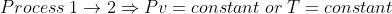
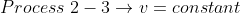
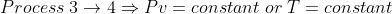
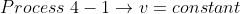
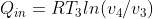
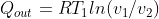
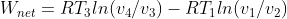
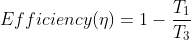

## INTRODUCTION 

The Stirling Cycle is named after Robert Stirling, who invented the Stirling cycle engine in 1816. Its practical use was restricted to low-power domestic applications for a long time.

#### User Objectives and Goals: 

  1. Understand the various processes involved in the Stirling cycle.
  2. Calculate P2, P4, v2 and v4.
  3. Calculate the Qin (heat added), Qout (heat rejected) and Wnet (Net work output).
  4. Calculate the efficiency of the Stirling cycle.
  5. Analyze the effect of change in parameters (P1, P3, v1, v3 ) on Qin (heat added), Qout(heat rejected), Wnet (Net work output), and efficiency of the Stirling cycle.
  6. Visualise the change in the P-v graph as the parameters(P1, P3, v1, v3) are changed.

#### Theory 

The ideal Stirling cycle is a reversible thermodynamic cycle. It differs from the Carnot cycle in that the two isentropic processes are replaced by two constant-volume regeneration processes.

The idealized Stirling cycle consists of four thermodynamic processes acting on the working fluid:
1-2 Isothermal compression.
2-3 Constant volume regeneration (internal heat transfer from the working fluid to the regenerator)
3-4 Isothermal expansion.
4-1 Constant volume regeneration (internal heat transfer from the regenerator back to the working fluid)

In this experiment, we demonstrate the change in P-v graph of Stirling Cycle, as the pressure and volume variables change. The heat addition, heat rejection, net work output, as well as efficiency of the cycle is calculated and displayed.

#### Abbreviations: 

1. P1, v1, T1 = Pressure, volume and temperature values at the beginning of Process 1-2
2. P2, v2, T2 = Pressure, volume and temperature values at the beginning of Process 2-3
3. P3, v3, T3 = Pressure, volume and temperature values at the beginning of Process 3-4
4. P4, v4, T4 = Pressure, volume and temperature values at the beginning of Process 4-1
5. Qin = Heat addition from external source (kJ/kg)
6. Qout = Heat rejection to external sink (kJ/kg)
7. Wnet = Net work output (kJ/kg)
8. R (Gas constant of air) = 0.287 kJ/kg.K
9. Cp (Specific heat of air at constant pressure) = 1.005 kJ/kg.K
10. Cv (Specific heat of air at constant volume) = 0.718 kJ/kg.K
11. Efficiency (╖) = Efficiency of Stirling Cycle

#### Equations/formulae: 

 

 

 

 

 

 

 

 
