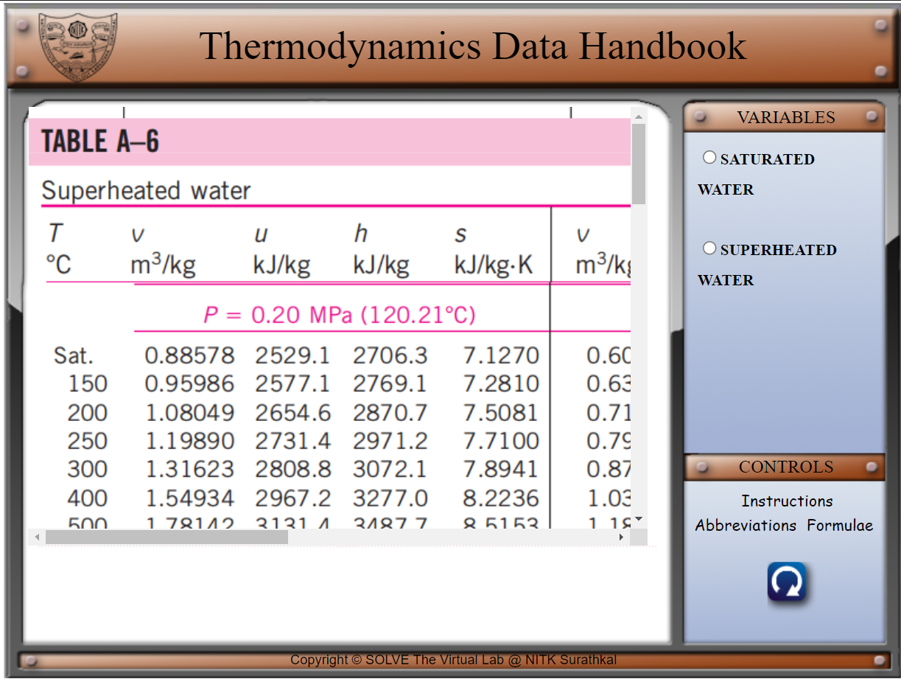
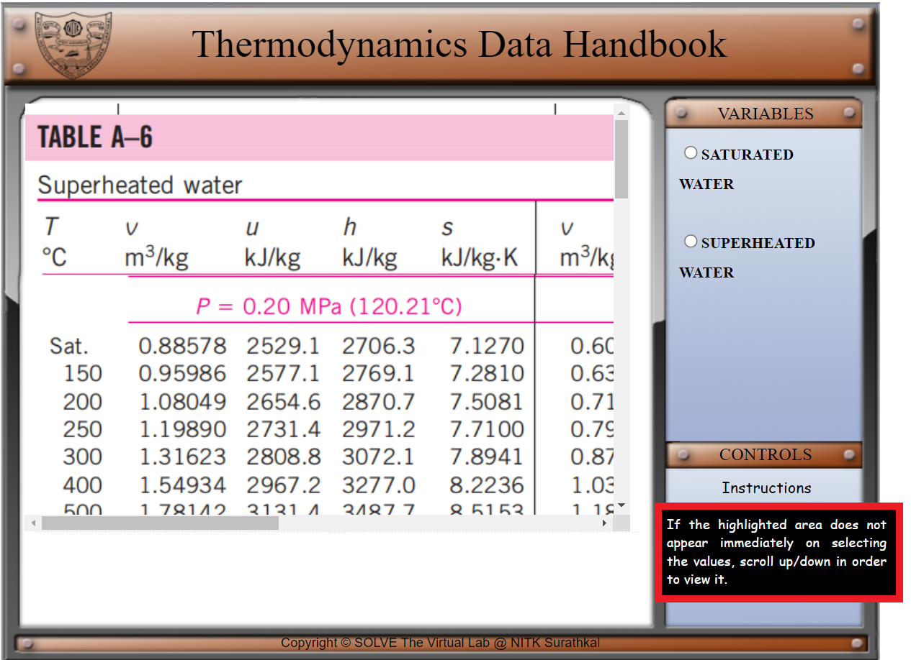
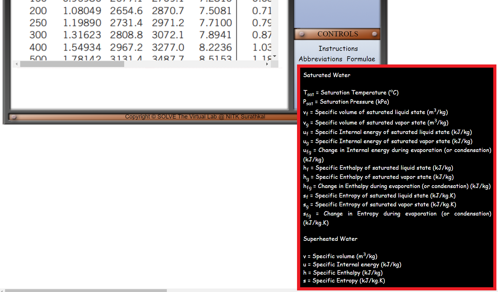
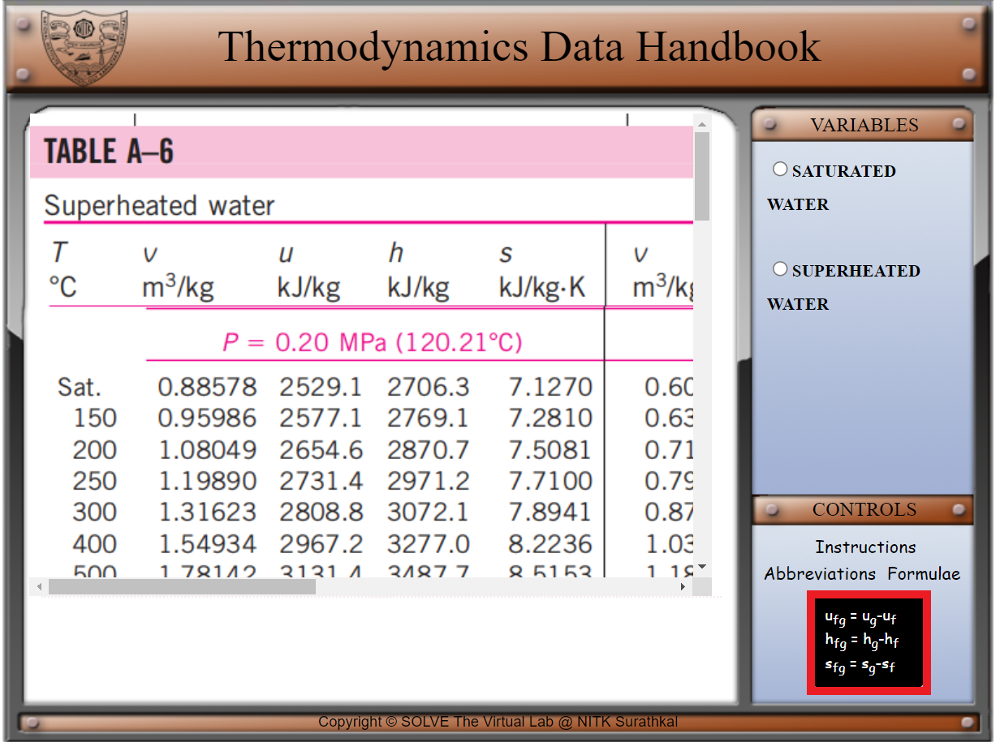
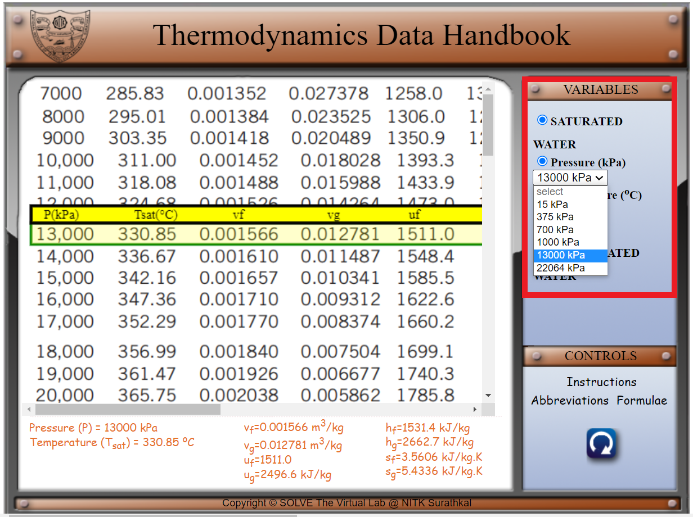
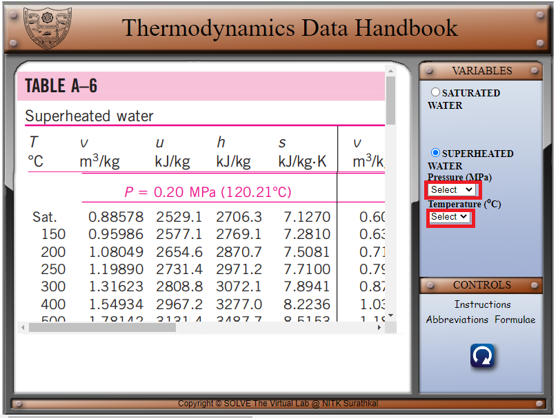

#### These procedure steps will be followed on the simulator

1. In the simulation window, the thermodynamics data handbook saturated and superheated water tables are available.
2. The various symbols, instructions and the formulae are displayed in the control panel when the cursor hovers over ‘Abbreviations’, ‘Instructions’ and ‘Formulae’ respectively.  

<!--   -->

<!--   -->

 

3. The parameters can be changed by changing the variables as shown. 

 

4. Use the drop-down menu to select the pressure and temperature values for the saturated and superheated water tables. 

 

5. The saturated thermodynamic properties (pressure or temperature), specific volume, specific internal energy, specific enthalpy and specific entropy values are given at the bottom. 

 
