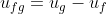

## INTRODUCTION 

#### User Objectives and Goals:

  1.  Understand the use of the thermodynamics data handbook and the concept behind the saturated and superheated water tables.
  2.  Understand the various thermodynamics properties such as the enthalpy, internal energy, entropy and their units.
  3. Visualize the required quantities in the table that have been marked.
  4. Calculate the specific thermodynamics properties using the necessary values from the table.

#### Theory

#### Equations/formulas:

1. Tsat = Saturation temperature (℃)
2. Psat = Saturation pressure (kPa)
3. vf = Specific volume at saturated liquid state (m3/kg)
4. vg = Specific volume at saturated vapour state (m3/kg)
5. uf = Specific internal energy at saturated liquid state (kJ/kg)
6. ug = Specific internal energy at saturated vapour state (kJ/kg)
7. ufg = Change in internal energy during evaporation (or condensation) (kJ/kg)
6. hf = Specific enthalpy at saturated liquid state (kJ/kg)
7. hg = Specific enthalpy at saturated vapour state (kJ/kg)
8. hfg = Change in enthalpy during evaporation (or condensation) (kJ/kg)
9. sf = Specific entropy at saturated liquid state (kJ/kgK)
10. sg = Specific entropy at saturated vapour state (kJ/kgK)
11. sfg = Change in entropy during evaporation (or condensation) (kJ/kgK)

 

 

 
