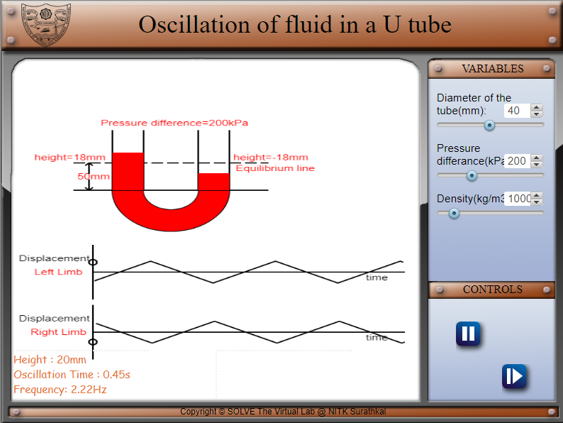
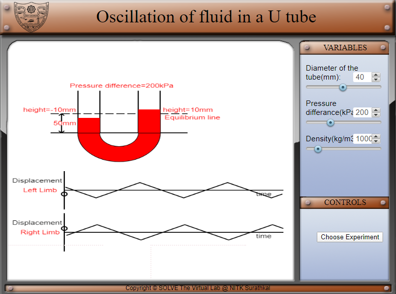
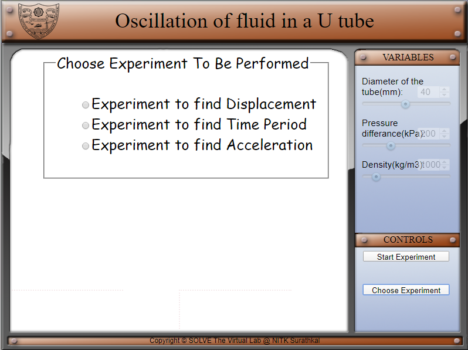
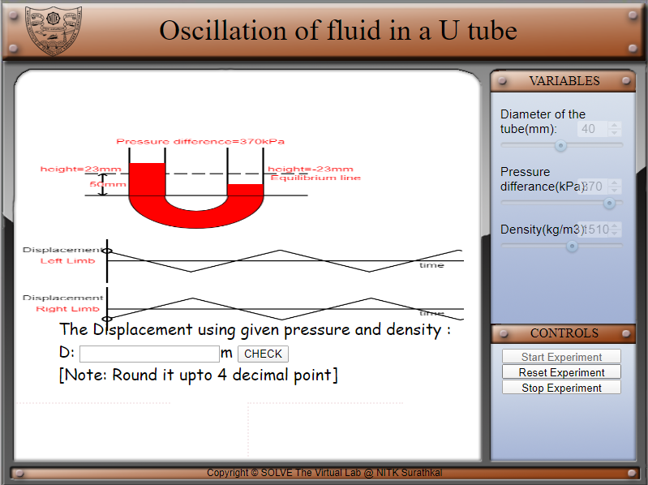
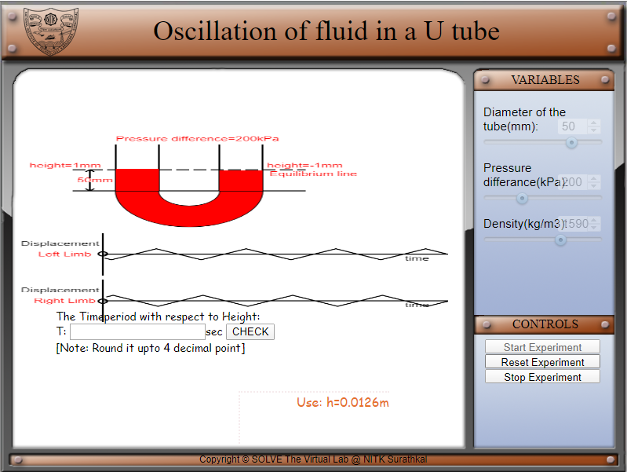
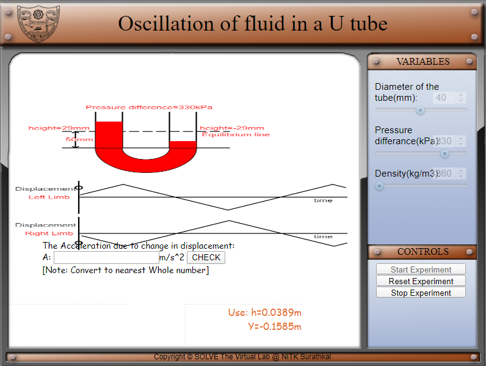

#### These procedure steps will be followed on the simulator

1. In simulation the window the front view of the U tube is displayed.
2. The displacement v/s time graph for left and right limbs are displayed bellow the U tube.  
3. The control parameters are displayed on the top right corner of the window. On the bottom right part the play/pause button is displayed.  

4. Move the slider knob to the right to increase the diameter of the tube, pressure & density and play the values.

5. The height, time period of oscillation and frequency of oscillation is displayed on the bottom left corner of the screen. The instantaneous height with respect to equilibrium line is displayed on either limbs of the U tube.  

6. when next button is pressed it will lead the user to select experiment.

7. the user has to select the experiment he/ she has to perform.  

8. when user can select the experiment he /she want to perform and press start experiment

9. when the user selects the experiment for finding displacement this fame appears with the question and random value. The user has to put the value into check box and check the value.

10. when the user selects the experiment for finding time period this fame appears with the question and random value. The user has to put the value into check box and check the value.

11. when the user selects the experiment for finding acceleration this fame appears with the question and random value. The user has to put the value into check box and check the value.

