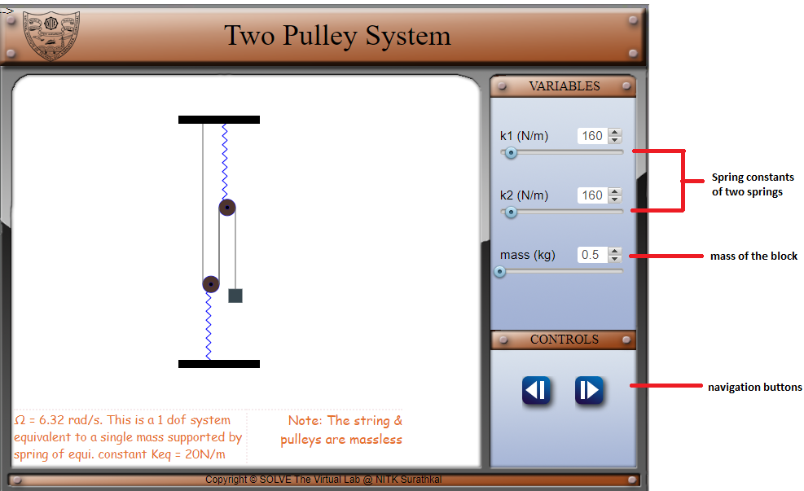
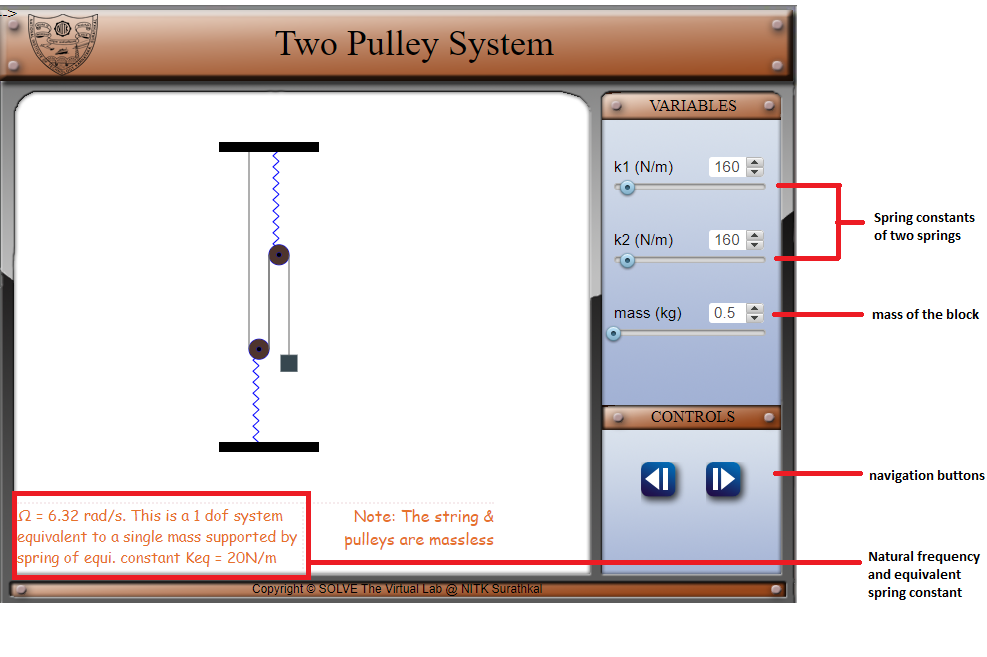
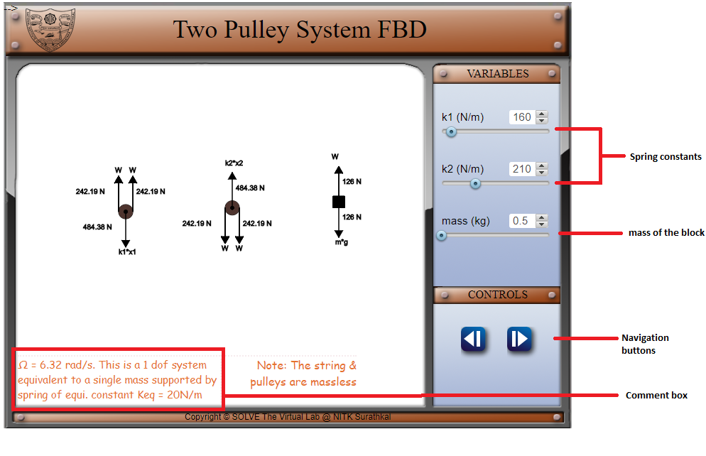

#### These procedure steps will be followed on the simulator

1. In simulation window two pulley system is shown.
2. There are pointers given on right side of the screen for choosing the values of input variables, viz., mass, k1 and k2. After setting these variables..
 

3. Observe the natural frequency and equivalent spring constant for the changed variables.
 

4. Press next button. The forces acting on each component can be visualized by seeing free body diagrams.
 
