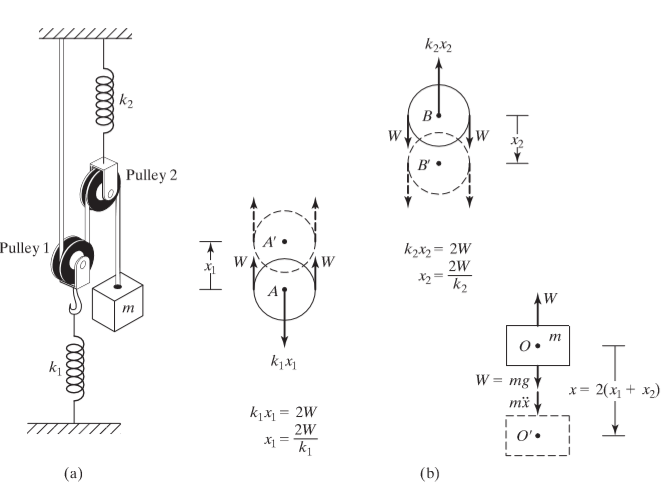
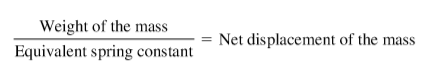

## INTRODUCTION 

  

#### User Objectives and Goals:  

1. List the examples for 1 dof .
2. Solve the mathematical equations to find natural frequency.
3. Examine the analytical results with the simulation results
4. Evaluate how change in k , c and mass influences the natural frequency
5. Attempt the assessment questions.

#### Theory
The two pulley system is equivalent to a single mass supported by a single spring of equivalent spring constant Keq .Hence this is a 1 degree of freedom system. The aim of the experiment is to visualize how the mass moves. Rope, springs and pulleys are assumed to be massless. Real time free body diagrams for all the components is provided for better understanding.  
To find out the natural frequency of the 2 pulley system by analytical and simulation methods. To determine the natural frequency, we find the equivalent stiffness of the system and solve it as a single-degree-of-freedom problem. Since the pulleys are frictionless and massless, the tension in the rope is constant and is equal to the weight W of the mass m. From the static equilibrium of the pulleys and the mass.  

  

as the rope on either side of the pulley is free to move the mass downward. If keq denotes the equivalent spring constant of the system,

By displacing the mass m from the static equilibrium position by x, the equation of the motion of the mass can be written as

and hence the natural frequency is given by,

or

REFERENCE: Mechanical Vibrations – SS Rao (4th edition)

